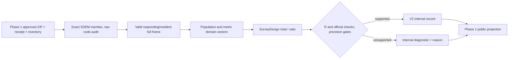

# Phase 2: Defensible Survey Estimates — Research

**Researched:** 2026-09-22  
**Domain:** ENOE complex-survey estimation and numerical reconciliation  
**Confidence:** MEDIUM — eight source-code/design audits passed; final metric adapter/oracle and official precision acceptance remain work.

## User Constraints

Phase 2 `02-CONTEXT.md` now records the user's recommended-default decisions. Carry forward these locked Phase 1 interfaces: eight approved SHA-pinned snapshots; national benchmark residents/respondents with operational `15<=EDA<=98` (98 means unknown age); completed-professional profiles with known `15<=EDA<=97`, `CS_P13_1=7`, `CS_P16=1`; fields from each package catalog; v1 unchanged and separate v2 internal/public records; diagnostic `estimate` distinct from public `value`; singleton precision never labeled official. Phase 1 leaves Phase 2 responsible for numerical acceptance. [VERIFIED: `02-CONTEXT.md`; `.planning/phases/01-official-sources-and-research-contract/01-CONTEXT.md`; `01-02-PLAN.md`; `01-03-PLAN.md`]

## Summary

Use the existing `SurveyDesign` for Taylor ultimate-cluster totals and ratios after a strict, period-aware SDEM adapter constructs the **entire** valid responding/resident frame. Keep all full-frame PSUs, including zero contributors to a domain. Reuse Phase 1 `POPULATION_DEFINITIONS`, inventory and v2 projection; Phase 2 owns metric masks, variance acceptance, and reconciliations. [VERIFIED: `brujula/survey.py`; Phase 1 plans; [R survey manual](https://r-forge.r-universe.dev/survey/doc/manual.html)]

The eight pinned SDEM snapshots passed an offline aggregate audit of member/dictionary identity, selected numeric encodings, design keys, weights and cohort counts. This is input evidence, not validated labor estimates. An existing 2026-Q2 Python/R prototype agrees on four point/SE pairs with `singleton_policy="adjust"`, but its Derecho mask includes `EDA=98`; it is not the final cohort oracle. The 2025-Q2 official workbook matches six national/Baja California count totals exactly. The project SEs differ from the official workbook and must remain reported as approximation discrepancies. [VERIFIED: `.cache/research/eight-quarter-audit.json`; `.cache/research/python-r-survey-comparison.json`; `.cache/research/official-precision-comparison.json`]

**Primary recommendation:** Build one validated eight-snapshot SDEM-to-metric adapter, regenerate a final-population R oracle, and gate every v2 record on both independent and official numerical evidence. [VERIFIED: Phase 1 interfaces; STAT-01–06]

<phase_requirements>
## Phase Requirements

| ID | Research support |
|---|---|
| STAT-01 | Full-frame design, domain masks, weighted total/ratio/mean recipe below. |
| STAT-02 | Precision/support mapping and method identity below. |
| STAT-03 | Central suppression table and public projection. |
| STAT-04 | Rebuilt R oracle, analytical controls and untuned comparisons. |
| STAT-05 | Pinned 2025-Q2 official workbook reconciliation, expanded where compatible. |
| STAT-06 | Metric definitions and per-field sentinel audit. |
</phase_requirements>

## Architectural Responsibility Map

| Capability | Primary tier | Secondary tier | Reason |
|---|---|---|---|
| Snapshot resolution and member identity | Local acquisition layer | Filesystem | Phase 1 owns authoritative ZIP/member/receipt evidence. [VERIFIED: Phase 1 plans] |
| Row codes and metric domains | Local adapter | Population rules | Per-period dictionary and cohort rules precede estimation. [VERIFIED: Phase 1 plans; ENOE method review] |
| Points and SEs | Local survey engine | R oracle | Python publishes only after independent comparison. [VERIFIED: `brujula/survey.py`; STAT-04] |
| Public suppression | V2 contract/projection | Static outputs | One projection prevents hidden estimates leaking. [VERIFIED: `01-03-PLAN.md`] |

## Project Constraints (from AGENTS.md)

Read `docs/CONTRACT.md` before interface changes. Use local scripts, fixtures and isolated tests; no paid API, external inference, credentials, third-party messages, app/service, or unapproved source read. Keep dimensions distinct, missing null, synthetic visibly synthetic, and every claim evidenced. Raw person rows stay local; publication contains only validated redistributable aggregates. Failed refresh invalidates current; no agent proposal activates a source/bridge. Preserve other contributors' edits and exclude unrelated proprietary material. [VERIFIED: `AGENTS.md`]

## Standard Stack

| Component | Version | Use |
|---|---|---|
| Python | 3.12.13 local | Adapter/orchestration. [VERIFIED: local executable] |
| NumPy | 2.5.3 local and PyPI release 2026-09-06 | Existing `SurveyDesign` arrays; add as explicit `pyproject.toml` runtime dependency because imported directly. [VERIFIED: local import; `brujula/survey.py`; [NumPy docs](https://numpy.org/doc/stable/user/absolute_beginners.html); [PyPI release](https://pypi.org/project/numpy/2.5.3/)] |
| R / `survey` | R 4.6.1 / survey 4.5 local | Independent `svydesign`, `svytotal`, `svyratio` oracle; keep in research/test environment, not Python runtime. [VERIFIED: local executables; [survey manual](https://r-forge.r-universe.dev/survey/doc/manual.html)] |
| pytest | 9.0.3 local | Analytic, adapter, oracle and projection gates. [VERIFIED: local import] |

No new estimator library is needed. The local Python venv has no `pip` module, but `uv` is available as the trusted package manager (`${UV_EXECUTABLE}`; use `--cache-dir .cache/uv` within this workspace). PyPI confirms the exact NumPy 2.5.3 release and its Python >=3.12 requirement. `slopcheck` was unavailable, so the package legitimacy protocol requires `[ASSUMED]` on a new install even though package identity/version and existing local execution are verified. Add the direct dependency without treating a missing optional audit utility as a statistical blocker. [VERIFIED: local commands; `pyproject.toml`; [PyPI release](https://pypi.org/project/numpy/2.5.3/)]

## Package Legitimacy Audit

| Package | Registry | Local evidence | slopcheck | Disposition |
|---|---|---|---|---|
| `numpy` | [PyPI 2.5.3](https://pypi.org/project/numpy/2.5.3/) | 2.5.3 imports locally; official docs identify package; release dated 2026-09-06 | unavailable | Direct dependency approved by existing usage and official registry; new install retains protocol tag `[ASSUMED]` until slopcheck. |

## Architecture Patterns



**Adapter contract:** `estimate_snapshot(snapshot_id, output_root) -> internal v2 payload + aggregate-only audit`, calling `inventory_snapshot(snapshot_id, output_root=...)`/the Phase 1 resolver before reading the exact main SDEM member. Check actual Phase 1 signature at integration time. Decode the data CSV as Latin-1 and bundled dictionary as UTF-8, as the eight-snapshot audit did; retain raw lexeme and typed value separately. All initially suspicious selected tokens proved ASCII-space blanks or, for 2024-Q3 through 2025-Q2 CMPE, ASCII-space-padded numeric codes (`" 11000"` → `"11000"`); trim only U+0020, preserve blank as null, then require ASCII digits for numeric fields. `CS_P14_C` is a six-character catalog code and still needs the Phase 1 six-digit normalization/catalog membership; never turn blank into a field. Accept precisely `R_DEF="0"` and `"00"` as valid-response aliases (the latter occurs in 2025-Q4), with `C_RES∈{"1","3"}`. Reject any other unexpected token or missing required design field. Never use a substring search to pick a member. [VERIFIED: `01-01-PLAN.md`; `.cache/research/eight-quarter-audit.py`; `.cache/research/eight-quarter-audit.json`]

**Design construction:** valid `R_DEF=0`, `C_RES∈{1,3}` first; `FAC_TRI` finite/positive, `EST_D_TRI` and `UPM` nonblank, with stratum/PSU nesting checked. Then derive age/field/entity/sex/outcome masks on the full arrays. For an out-of-domain person, the algebraic contribution is zero, while the original PSU remains in the variance. The source value remains missing when missing. `SurveyDesign(..., singleton_policy="fail")` is the default. The explicitly selected `"adjust"` option matches R's project approximation, produces `REVIEW`, and must retain a nonofficial precision note. [VERIFIED: `brujula/survey.py`; `.cache/research/oracle-adjust.R`; [survey manual](https://r-forge.r-universe.dev/survey/doc/manual.html)]

**Metric vectors (D = named population × geography × field domain; O = `CLASE2=1`; A = metric-specific valid response):** [VERIFIED: [INEGI SDEMT225 dictionary](https://www.inegi.org.mx/rnm/index.php/catalog/1121/data-dictionary/F42?file_name=SDEMT225); `docs/research/ENOE-METHOD-REVIEW.md`; Phase 1 cohort decision]

| Metric | Python operation and numerator / denominator | Unit and invalid-state rule |
|---|---|---|
| Population, employed, PEA, unemployed | `total(1[D])`, `total(1[D & O])`, `total(1[D & CLASE1=1])`, `total(1[D & CLASE2=2])` | people; `CLASE1/2` missing/unexpected blocked for affected count; benchmark population uses age 98 operationally. |
| Employment, participation, unemployment rate | `ratio(1[D & O],1[D])`; `ratio(1[D & CLASE1=1],1[D])`; `ratio(1[D & CLASE2=2],1[D & CLASE1=1])`, `percent=True` | percent; unemployment denominator is PEA, not employed. Preserve class unknown counts. |
| Positive known monthly income | `ratio(INGOCUP·1[D & O & A],1[D & O & A])` | nominal MXN/month; `A`: `ING7C∈1..5`, exact amount `1..999998`; 6=no income, 7=unspecified, `INGOCUP=0` alone cannot establish zero, 999999 invalid. Contradictory state/amount blocks row for this metric. |
| Income amount coverage and no-income share | `ratio(1[D & O & A],1[D & O])`; `ratio(1[D & O & ING7C=6],1[D & O & ING7C∈1..7])` | percent; also show separate weighted/observed unspecified and invalid counts; do not call positive-income mean all-occupied mean. |
| Main-job informality | `ratio(1[D & O & EMP_PPAL=1],1[D & O & EMP_PPAL∈{1,2}])` | percent; category 0 does not enter valid denominator; this is main-job informal employment, not TIL1/sector informality. |
| Women among employed | `ratio(1[D & O & SEX=2],1[D & O & SEX∈{1,2}])` | percent; other/unknown recorded SEX excluded and counted. |
| Employment position | one share per `POS_OCU∈{1,2,3,4}` over occupied with `POS_OCU∈{1,2,3,4}` | percent; 0 no aplica, 5 unspecified; do not infer 0 as an occupation category. [CITED: https://www.inegi.org.mx/rnm/index.php/catalog/1121/variable/F42/V5690?name=POS_OCU] |
| Suboccupation | `total(1[D & O & SUB_O=1])`; rate denominator `D & O` | people / percent; the eight audited cross-tabs confirm SUB_O=1 only among occupied and SUB_O=0 both inside/outside occupied. Keep the source label 0 (*no aplica*); never infer a universal binary category from it. [CITED: https://www.inegi.org.mx/rnm/index.php/catalog/1121/variable/F42/V5711?name=SUB_O; VERIFIED: final eight-quarter audit] |
| Known weekly hours and hours coverage | `ratio(HRSOCUP·1[D & O & A],1[D & O & A])`; coverage `ratio(1[D & O & A],1[D & O])` | hours/week and percent; A = positive hours 1..168 with DUR9C 2..8, or zero hours with DUR9C=1 temporary absence. Exclude DUR9C=9 unspecified, even when physical HRSOCUP=0. Label the inclusion of temporary absences. Eight-quarter joint counts support the distinction. [CITED: https://www.inegi.org.mx/rnm/index.php/catalog/1121/variable/F42/V5728?name=HRSOCUP; https://www.inegi.org.mx/rnm/index.php/catalog/1121/variable/F42/V5695?name=DUR9C] |

Store each metric definition as data: ID, numerator/denominator eligibility, unit, price basis, missing/sentinel policy, coverage counters and source dictionary refs. Populate v2 method/design/version and source snapshot IDs per record. `sample_size` is observed eligible denominator n; `n_psu_domain` is contributing PSUs, while `design_df=full-frame PSU count−strata count`; neither is effective sample size. The current estimator reports `n_strata_design`, not contributing strata: add `n_strata_domain`/equivalent to satisfy STAT-02 and wire it into the v2 support schema without changing design degrees of freedom. [VERIFIED: `brujula/survey.py`; Phase 1 `01-03-PLAN.md`; STAT-02]

## Don't Hand-Roll

| Problem | Use | Reason |
|---|---|---|
| Source selection/receipts | Phase 1 resolver/inventory | Pinned hash and failed-current semantics already governed. [VERIFIED: Phase 1 plans] |
| Population and field codes | Phase 1 `brujula/populations.py` | One authoritative cohort/catalog normalization. [VERIFIED: `01-02-PLAN.md`] |
| Complex-survey reference values | R `survey` | Independent implementation and explicit lonely-PSU options. [CITED: https://r-forge.r-universe.dev/survey/doc/manual.html] |
| Public suppression | `public_research_projection` | Existing Phase 1 allowlist/schema boundary prevents diagnostic leakage. [VERIFIED: `01-03-PLAN.md`] |

## Common Pitfalls

| Pitfall | Required gate |
|---|---|
| Filtering to Derecho/working/age before design | Assert full-frame PSU/strata counts and zero-contribution PSUs; compare R domain output. [VERIFIED: `brujula/survey.py`; survey manual] |
| Treating all non-digit lexemes as corruption | Eight-snapshot PASS required U+0020 blank/padding normalization; retain raw lexeme and assert that no other non-digit class appears in selected fields. [VERIFIED: `.cache/research/eight-quarter-audit.json`; audit script] |
| Treating PEA as occupied | The initial audit used CLASE1=1. The corrected full eight-quarter run now uses CLASE2=1 and passes with an explicit invariant; all affected frequency tables were regenerated. Add an adapter negative control for an unemployed PEA row. [VERIFIED: `.cache/research/eight-quarter-audit.py`; corrected JSON] |
| Prototype oracle mistaken for final cohort | Rebuild Q2 2026 oracle with `15..97` and Phase 1 catalog membership; prototype Derecho includes 98. [VERIFIED: `.cache/research/python-r-survey-comparison.json`] |
| Exact official SE equality claimed | Preserve untuned signed/relative differences and mark project variance approximation; official 2025-Q2 national population relative SE difference −0.0037148697. [VERIFIED: `.cache/research/official-precision-comparison.json`] |
| Rounding hides rate disagreement | Keep raw rate point deltas; additionally test membership in official four-decimal rounding interval, not a wider generic tolerance. [VERIFIED: official workbook/probe] |
| Suppressed internal SE, CI or weighted denominator leaks | Run nested sentinel scan of entire projected public JSON; null all revealing point/precision data, retain labeled observed n, PSU/strata/df. [VERIFIED: `01-03-PLAN.md`] |
| Adjacent quarters treated independent | Limit Phase 2 to per-quarter estimates; do not sum rotating samples as distinct people or infer change significance without covariance. [CITED: https://www.inegi.org.mx/rnm/index.php/catalog/1121] |

## Code Examples

```python
# Existing project API: keep the respondent/resident frame intact.
design = SurveyDesign(weights, strata, psu, singleton_policy="adjust")
population = design.total(population_indicator, domain=national_age_mask)
unemployment = design.ratio(unemployed_indicator, pea_indicator,
                            domain=national_age_mask, percent=True)
# Both arrays are full-frame length; invalid outcomes are excluded by explicit masks.
```

```r
# Source: https://r-forge.r-universe.dev/survey/doc/manual.html
options(survey.lonely.psu="adjust", survey.adjust.domain.lonely=FALSE)
d <- svydesign(ids=~upm, strata=~stratum, weights=~fac_tri,
               data=full_resident_respondent_frame, nest=TRUE)
svytotal(~employed_domain_indicator, d)
svyratio(~income_times_valid_domain, ~valid_income_domain, d)
```

## Resolved Decisions and Numerical Acceptance

1. **Eight-quarter input audit — resolved at aggregate level:** current `eight-quarter-audit.json` is `PASS` for all eight pinned main SDEM/dictionary pairs: 417,128–423,744 source rows, 406,740–415,147 valid respondent/resident rows, no unexplained selected numeric lexemes, no selected zero/negative `FAC_TRI`, and no unknown recorded-sex codes in the positive-weight selected frame. `ENT` is used through 2025-Q2 and `CVE_ENT` from 2025-Q3. Full-frame singleton-stratum counts by quarter are 53, 39, 124, 7, 23, 11, 16, 13; `fail` therefore blocks all eight; CONTEXT explicitly selects the reviewed `adjust` approximation for the adapter while retaining the engine default. `EDA=98/99`, blank CMPE and `999999` exist and must remain separately counted/excluded as defined. Final adapter acceptance: assert exact member/dictionary hashes, permitted raw-token classes and response aliases, per-quarter catalog membership, finite positive design weights, PSU nesting, and reasoned unknown/exclusion counts; add negative fixtures for a new token, invalid weight, wrong alias and padded/blank CMPE. This PASS does **not** establish variance or official precision. The misnamed PEA-scope summaries were corrected to CLASE2=1 and all eight were rerun; final DUR9C/SUB_O catalogs and joint-state counts are present. Adapter tests must preserve these meanings. [VERIFIED: `.cache/research/eight-quarter-audit.py`; `.cache/research/eight-quarter-audit.json`]
2. **Singleton policy:** 2026-Q2 prototype has 13 singleton strata and Python/R four case points/SEs agree to floating-point precision with `adjust`; 2025-Q2 official probe has seven. Use `adjust` only as explicit approximation `REVIEW`, retain `fail` default and record both outcomes. A supported `REVIEW` value still needs the explicit project release gate; matching R alone does not make the approximation official. Rebuild R oracle from the final cohort and test national, three focal fields, selected entity, totals/rates/means, plus analytic controls. Acceptance: predeclared numerical tolerance based on floating-point scale, no post-hoc adjustment, complete signed-error ledger. [VERIFIED: local comparison JSON; `brujula/survey.py`; Phase 1 decisions]
3. **Official comparison:** pinned 2025-Q2 workbook `21b45fb…` and SDEM ZIP `9530a017…` give exact six population/PEA/unemployed point totals across national and Baja California. Four-decimal official rates differ raw by −0.0000377761 national and +0.0000042633 BC; compare with the official rounding quantum separately. SE relative differences are nonzero (worst −0.0037148697 national population). Keep `official_precision=false`, label project approximation, and retain `REVIEW` under the explicit CONTEXT policy. Display the variance discrepancy and unavailable official stratum treatment; the policy does not claim it resolved numerically. Expand to another compatible quarter/edition when official table exists; do not invent a 2026 stratum-collapse map. [VERIFIED: `.cache/research/official-precision-comparison.json`; [official workbook](https://www.inegi.org.mx/rnm/index.php/catalog/1121/download/35892)]

## Environment Availability

| Dependency | Available | Evidence |
|---|---|---|
| Eight approved cached ZIPs | yes | Phase 1 resolver/research and eight-quarter audit. [VERIFIED: local files] |
| Python 3.12.13 / NumPy 2.5.3 / pytest 9.0.3 | yes | Local version/import probes. [VERIFIED: local commands] |
| R 4.6.1 / survey 4.5 | yes | Local `Rscript` and package probe. [VERIFIED: local commands] |
| `uv` package manager | yes | Installed at `${UV_EXECUTABLE}`; set local cache dir. [VERIFIED: parent local probe] |
| slopcheck | no | Command unavailable; preserve package protocol tag. [VERIFIED: local command] |

## Validation Architecture

| Requirement | Focused command / Wave 0 addition |
|---|---|
| STAT-01/02/03 | Existing `.venv/Scripts/python.exe -m pytest tests/test_survey.py -q`; add `tests/test_enoe_adapter.py` full-frame, masks, support and suppression tests. [VERIFIED: repo tests] |
| STAT-04 | Add `tests/test_survey_oracle.py` invoking pinned local R only in oracle-enabled run, plus committed aggregate golden fixtures and analytical controls; quick run excludes full ZIP load. [VERIFIED: local R; current prototype] |
| STAT-05 | Add `tests/test_official_reconciliation.py` using pinned aggregate fixture with separate exact count, rounding-interval rate and raw SE-difference assertions. [VERIFIED: official probe] |
| STAT-06 | Add table-driven `tests/test_enoe_metrics.py` per metric, category, sentinel, empty denominator, unknown state, field/age boundary and all-eight dictionary manifest. [VERIFIED: method review; eight audit] |

**Per task:** affected focused tests under 30 seconds on synthetic/aggregate fixtures. **Per wave:** full `pytest -q` plus all-eight offline adapter audit. **Phase gate:** final-cohort R replay, official workbook ledger, and strict v2 internal/public validation. No person-level fixtures or microdata in git. [VERIFIED: `AGENTS.md`; `.planning/config.json`; Phase 1 plans]

## Security Domain

ASVS V2 authentication/V3 sessions do not apply to this local pipeline. V4 boundary is local microdata versus public aggregates; V5 validates ZIP member, row codes, weights, domain masks, v2 schema and suppression; V6 uses existing SHA-256 source integrity, without custom crypto. Threats are source/member spoofing, malformed rows altering denominators, and revealing a suppressed value through SE/CI/weighted support. Use the approved resolver, strict adapter, and central public projection with negative sentinel tests. [VERIFIED: `AGENTS.md`; `.planning/config.json`; Phase 1 plans]

## Assumptions Log

| # | Claim | Risk |
|---|---|---|
| A1 | A fresh NumPy 2.5.3 installation passes the slopcheck gate. `[ASSUMED]` | Run the best-effort audit when available; PyPI version/identity and current local import are already verified. |
| A2 | The current Phase 1 planned signatures remain exactly as written after execution. `[ASSUMED]` | Adapter must inspect implemented API before integration. |

## Sources

- [INEGI SDEMT225 dictionary](https://www.inegi.org.mx/rnm/index.php/catalog/1121/data-dictionary/F42?file_name=SDEMT225), [POS_OCU](https://www.inegi.org.mx/rnm/index.php/catalog/1121/variable/F42/V5690?name=POS_OCU), [SUB_O](https://www.inegi.org.mx/rnm/index.php/catalog/1121/variable/F42/V5711?name=SUB_O), [HRSOCUP](https://www.inegi.org.mx/rnm/index.php/catalog/1121/variable/F42/V5728?name=HRSOCUP), [official 2025-Q2 precision workbook](https://www.inegi.org.mx/rnm/index.php/catalog/1121/download/35892). [CITED: linked official pages]
- [R `survey` 4.5-2 manual](https://r-forge.r-universe.dev/survey/doc/manual.html); [NumPy official docs](https://numpy.org/doc/stable/user/absolute_beginners.html). [CITED: linked official documentation]
- Local: `brujula/survey.py`, `tests/test_survey.py`, `docs/research/ENOE-METHOD-REVIEW.md`, `.cache/research/{python-r-survey-comparison,official-precision-comparison,eight-quarter-audit}.json`, Phase 1 CONTEXT/RESEARCH/plans. [VERIFIED: local read]

## Metadata

**Confidence breakdown:** stack HIGH (local runtime and official docs); architecture HIGH (existing code and locked Phase 1 interfaces); eight-quarter source/design encoding HIGH for audited selected fields, metric-domain validity MEDIUM pending production adapter tests; corrected occupied and joint-state audits now pass; official precision MEDIUM (one compatible edition, nonzero variance discrepancy).  
**Valid until:** 2026-10-22, or earlier if Phase 1 interfaces or source editions change.
