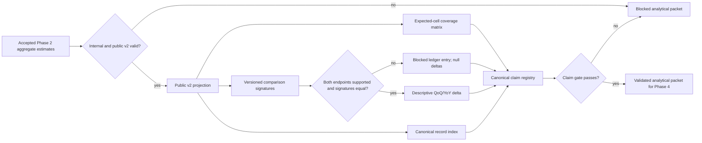

# Phase 3: Supported Labor Findings — Research

**Researched:** 2026-09-22
**Domain:** deterministic ENOE analysis, comparison and evidence-bound claims
**Confidence:** MEDIUM (phase 2 estimates and final interfaces are pending)

<user_constraints>
## User Constraints (from CONTEXT.md)

### Locked Decisions
- Explain what the ENOE can say about work among people whose completed professional study field is Derecho, Comunicación y periodismo, or Ciencias políticas. Keep the known-age completed-professional cohort label and exclusions visible; do not imply all graduates or all workers in a profession.
- Provide national context and the total professional cohort for all eight quarters. Give the three focal fields full national profiles and trends across those quarters, with employment, participation, unemployment, known positive income and its coverage, main-job informality, recorded sex, employment position, suboccupation and known weekly hours as accepted in Phase 2.
- Include the other identifiable professional fields in a national comparison table for the latest quarter, without inventing fields for missing codes. Use their actual official catalog labels and separate coverage status from substantive outcomes. A sorted table is not a universal career ranking.
- For the latest quarter, include all 32 entities and both recorded sexes for the three focal fields and cohort total. Unsupported cells stay visible with null and a reason; do not drop sparse states to make a chart look complete. Keep sex slices separate from entity slices unless support and a specific question justify an intersection.
- Preserve the national operational 15+ context separately from the known-age professional cohort; comparison requires matching population identity.
- Resolve the 2025-Q3 ENT→CVE_ENT representation change using verified code/name catalogs, matching definitions and official cross-boundary comparisons, not column-name equality alone. Research evidence is in `.planning/research/GEOGRAPHY-COMPARABILITY.md`.
- Require equality of source family, population definition/version, normalized geography concept, recorded-sex selection, field/occupation/industry concepts, metric/denominator, unit, price basis, classification and estimator method/version. Snapshot hashes legitimately differ across quarters and remain exact provenance; same source family is not a license to compare revised editions silently.
- Require ordered compatible quarterly periods and supported endpoint values. Block mismatches and null endpoints explicitly with null deltas, never zero. Adjacent-quarter and year-over-year differences are descriptive, not tests of significance.
- Annual comparisons pair like quarters where available. Adjacent-quarter changes include a seasonality caveat. Income changes are nominal; do not call them changes in purchasing power. Do not compare minimum-wage income bands as a stable real-price classification across years.
- Rotating samples overlap. Never add people or sample sizes across quarters as independent individuals, and never infer a difference's precision from independent marginal intervals.
- Report observed support, response coverage and exclusion reasons by relevant period/field, including age unknown, field unknown, technical/postgraduate/incomplete studies and exact income unavailable. Weighted quantities are estimates, not sample sizes.
- Claims use canonical descriptive templates built from exact public records and valid comparisons. Each has IDs for underlying estimates, source snapshots and methods, plus precision and universe limitations.
- Reject arbitrary added numbers, causal phrasing, personal advice, altered metric/population labels and claims based on suppressed or incompatible endpoints. The claim registry is deterministic and testable; no model or external inference is needed.
- Choose up to three opening findings after the data pass, based on supported relevance and coverage rather than preselecting a sensational conclusion. If evidence cannot support three, show fewer and explain the limitation.
- Reports and exports must use only the validated v2 public projection. Analytical helpers cannot restore diagnostic values into public coverage or prose.

### the agent's Discretion
- Choose concrete module names and data structures after inspecting final Phase 2 interfaces; reuse complete frames and avoid repeated ZIP decoding for each domain.
- Prefer readable Spanish labels, explicit metric units and reusable record IDs. Keep analysis independent from rendering so every format uses the same accepted findings.

### Deferred Ideas (OUT OF SCOPE)
Static editorial layout, charts/PDF, export packaging, CLI/current promotion and release auditing are committed later phases. No causal model, personalized recommendation, deflator or new source is added to this milestone.
</user_constraints>

<phase_requirements>
## Phase Requirements

| ID | Description | Research Support |
|---|---|---|
| ANA-01 | Focal profiles, cohort and other fields | Coverage matrix, official CMPE labels, fixed scope |
| ANA-02 | Eight quarters and descriptive changes | Quarter-keyed series and QoQ/YoY ledger |
| ANA-03 | Strict comparable deltas | Versioned signatures and fail-closed pair checks |
| ANA-04 | Recorded-sex and 32-state slices | Explicit expected-cell grid and suppression reasons |
| ANA-05 | Support, response and exclusions | Aggregate coverage ledger per period/field |
| ANA-06 | Evidence-bound findings | Canonical record IDs, deterministic templates and gate |
</phase_requirements>

## Summary

Use accepted Phase 2 aggregate estimates as the sole numerical input, then build one validated analytical packet containing coverage grids, a comparison ledger, and deterministic claims. Keep national 15+ context distinct from the completed-professional known-age cohort. Phase 2 plans specify an estimator returning internal and public v2 payloads, but those APIs and acceptance results are pending; inspect the implemented signatures and accepted ledger before executing Phase 3. [VERIFIED: `.planning/phases/02-defensible-survey-estimates/02-02-PLAN.md`; `03-CONTEXT.md`]

The existing v2 grain has ten dimension keys and **no record `id`**. A canonical ID derived from that grain should index public records, comparisons, claims and later exports. The existing v1 comparison treats `source_id` as exact-equal and v1 insight prose rejects comparison claims, so both require separate v2 analytical implementations rather than extension by assumption. [VERIFIED: `brujula/research_contract.py`; `contracts/research-v2-public.schema.json`; `brujula/quality.py`; `brujula/insights.py`]

**Primary recommendation:** Plan a deterministic `analysis_v2` layer over `validate_public_research_v2(public_research_projection(...))`, with a versioned comparison signature, expected-cell coverage grid and exact-template claim registry. [VERIFIED: `brujula/research_contract.py`; `03-CONTEXT.md`]

## Architectural Responsibility Map

| Capability | Primary tier | Secondary tier | Rationale |
|---|---|---|---|
| Quarter/domain estimates | Local survey pipeline | Approved ZIP custody | Phase 2 owns numeric and precision gates. [VERIFIED: Phase 2 plans] |
| Comparison/coverage/claims | Local analysis pipeline | Public v2 projection | Phase 3 reads gated aggregates only. [VERIFIED: `03-CONTEXT.md`] |
| HTML/PDF/exports/current | Offline publication pipeline | — | Phase 4 owns rendering and release inputs. [VERIFIED: `.planning/ROADMAP.md`] |

## Project Constraints (from AGENTS.md)

Local scripts, fixtures and isolated tests are authorized; read `docs/CONTRACT.md` before interface changes. No paid API, external inference, credentials, third-party messages, frontend, backend service or navigable app. Public sources follow approved catalog; person records remain local. Keep study field, occupation, industry, geography, period and source separate; missing stays null. Comparability must cover source, universe, geography, measure, price basis, method, concept and period. Failed refresh invalidates current; claims need verified evidence; only validated artifacts may release. Preserve other contributors' edits, and use no proprietary data/code from unrelated workspaces. [VERIFIED: `AGENTS.md`; `docs/CONTRACT.md`]

## Standard Stack

| Component | Current version/state | Prescribed use |
|---|---|---|
| Python | 3.12.13 locally | Pure deterministic analysis over public aggregate records. [VERIFIED: local version probe] |
| `pytest` | 9.0.3 locally | Acceptance fixtures and negative controls. [VERIFIED: local version probe] |
| `jsonschema` / v2 schemas | pinned `4.26.0` in project; schemas present | Validate internal/public v2 input before analysis. [VERIFIED: `pyproject.toml`; `brujula/research_contract.py`] |
| Existing v2 projection | implemented, Phase 1 completion pending | Single public value boundary; consume its allowlisted result. [VERIFIED: `brujula/research_contract.py`; `.planning/ROADMAP.md`] |

No new external package is needed for Phase 3; no installation or package legitimacy audit applies. Do not add an LLM or independent rendering stack. [VERIFIED: `03-CONTEXT.md`; `AGENTS.md`]

## Architecture Patterns



Recommended files after Phase 2 signature inspection: `brujula/analysis_v2.py` for expected grids and profiles; `brujula/comparisons_v2.py` for signatures/deltas; `brujula/claims_v2.py` for templates and claim validation; corresponding focused tests. Do not alter v1 synthetic comparison/insight behavior. [VERIFIED: `docs/CONTRACT.md`; `brujula/quality.py`; `brujula/insights.py`]

### Data and identity rules

1. Build a sorted public-record index by all ten `GRAIN` fields. Canonical ID = stable version-prefixed digest of a canonical serialization of that tuple (or an explicitly reviewed schema change). Assert collision-free and identical IDs under row reordering. Retain the tuple itself in the claim ledger so a hash never substitutes for identity. [VERIFIED: `brujula/research_contract.py`; `03-CONTEXT.md`]
2. Materialize expected cells: eight national periods × national context/cohort/focal fields and accepted metrics; latest period × every official identifiable CMPE field; latest period × 32 states × cohort/focal fields; latest period × two recorded sexes × cohort/focal fields. Preserve null/reason cells and keep sex and state slices separate. Do not duplicate national context into professional field rows. [VERIFIED: `03-CONTEXT.md`; `.planning/REQUIREMENTS.md`]
3. Join Phase 2 aggregate coverage/exclusion audit to each relevant period/field. Report observed n, eligible/responding counts, income response coverage and named exclusion counts with explicit denominator; label weighted support as estimate. Coverage output must itself pass public-projection disclosure review, including complementary inference from totals. [VERIFIED: `brujula/populations.py`; Phase 2 plans; `03-CONTEXT.md`]
4. Treat official CMPE catalog labels as the only source for latest other-field names. `999999`, blank and absent field remain an unknown-field coverage bucket, never a named field. [VERIFIED: `brujula/populations.py`; `.planning/research/GEOGRAPHY-COMPARABILITY.md`]

### Comparison signature and delta

Use a resolved signature containing source **family** (`INEGI ENOE`), source edition/revision compatibility evidence, population ID and definition version, normalized geography concept/key, sex selection, field/occupation/industry IDs and classification versions, metric ID **and numerator/denominator definition version**, unit, price basis, estimator/design/method version, singleton/precision policy, and suppression rule version. Snapshot IDs and SHA-256 hashes remain different provenance fields on the two endpoints. If versioned metric or population definitions are not represented in the minimal v2 schema, join the versioned Phase 2 registry/method manifest; fail closed when absent. [VERIFIED: `03-CONTEXT.md`; `contracts/research-v2-public.schema.json`; Phase 2 `02-01-PLAN.md`]

That equality signature applies to longitudinal deltas. A separate same-period cross-slice comparator permits exactly one declared difference: recorded sex 1 versus 2 at fixed national geography, or one state versus a reviewed explicit reference state with recorded sex fixed. It requires the same exact snapshot ID/hash, period, source edition, population, field/occupation/industry, metric numerator/denominator, method, unit/basis, precision policy and geography type/concept. A missing reference, unsupported endpoint or second changing axis blocks. [DECIDED: `03-CONTEXT.md`; planned `03-02-PLAN.md`]

Normalize old `ENT` 1–32 to `01`–`32` and validate key/name equality with `CVE_ENT`; keep native alias and raw lexeme as provenance. The official 2025-Q3 bulletin compares national 2024-Q3 and 2025-Q3, supporting a reviewed cross-boundary candidate, but local field/state deltas still require the full signature. A changed header alone is neither proof of a redesign nor proof of equivalence. [VERIFIED: `.planning/research/GEOGRAPHY-COMPARABILITY.md`; CITED: https://www.inegi.org.mx/contenidos/saladeprensa/boletines/2025/enoe/enoe2025_11.pdf]

Generate only `q→q+1` and `q→q+4` pairs within the eight-quarter window. Require both public values non-null, supported status, exact comparable signatures and actual quarter adjacency. Store ordered endpoint IDs, all reasons, absolute delta, relative percent change only for a nonzero prior value, and display-unit change: percentage points for rates, people/hours/MXN for other units. The delta is descriptive; no SE, CI or significance for changes. QoQ text carries seasonality; income text says nominal. [VERIFIED: `03-CONTEXT.md`; `.planning/REQUIREMENTS.md`]

### Canonical claims

Build claims solely from an allowlist of typed templates: one supported public observation or one passing comparison, plus exact record IDs, source snapshot IDs, evidence refs, method IDs/version, universe and precision limitations. Regenerate canonical text during validation and compare exact text/typed quantities; lexical forbidden-phrase checks are secondary. Reject hand-edited labels, extra numerals, causal/significance language, advice, null endpoints or references outside the public index. Select at most three opening claims after the data pass by a documented deterministic relevance/coverage rule; fewer is valid. [VERIFIED: `brujula/insights.py`; `03-CONTEXT.md`]

## Don't Hand-Roll

| Problem | Use instead | Why |
|---|---|---|
| Survey point/precision estimates | Accepted Phase 2 estimator | Phase 3 has no authority to recompute or relax suppression. [VERIFIED: Phase 2 plans] |
| Source identity and ZIP decoding | Phase 1 resolver and Phase 2 aggregate output | Custody/hash/edition handling already owned. [VERIFIED: Phase 1/2 plans] |
| Public suppression | `public_research_projection` plus validator | One central allowlist avoids diagnostic leakage. [VERIFIED: `brujula/research_contract.py`] |
| Spanish freeform “insight” prose | Canonical typed templates | Exact record binding permits deterministic validation. [VERIFIED: `brujula/insights.py`; `03-CONTEXT.md`] |

## Common Pitfalls

| Pitfall | Acceptance gate |
|---|---|
| Treat snapshot ID/hash equality as source-family compatibility, or waive revision compatibility | Different quarter hashes pass only with matching family and reviewed edition/definition signatures; changed revision blocks. [VERIFIED: `03-CONTEXT.md`] |
| Apply v1 `compare_observations` to v2 records | v2 fixture spanning two valid snapshots compares while v1 behavior remains unchanged. [VERIFIED: `brujula/quality.py`] |
| Compare cohort against national 15+ or field against occupation | Identity mismatch yields blocked/null, even if labels look similar. [VERIFIED: `brujula/populations.py`; `03-CONTEXT.md`] |
| Hide sparse entities or turn null into zero | Assert 32 state rows for every latest focal/cohort grid, with explicit reason. [VERIFIED: `03-CONTEXT.md`] |
| Derive comparison SE from separate intervals or sum eight samples | No delta precision or cross-quarter person count in output. [VERIFIED: `03-CONTEXT.md`] |
| Publish suppressed internals via coverage, claims or alternate format | Entire Phase 3 packet built from validated public projection; nested sentinel and complementary-suppression tests. [VERIFIED: `brujula/research_contract.py`; `03-CONTEXT.md`] |

## Code Examples

```python
# Existing public gate; call only after Phase 2 acceptance.
from brujula.research_contract import GRAIN, public_research_projection, validate_public_research_v2

public = public_research_projection(internal_v2)
assert not validate_public_research_v2(public)
records_by_grain = {tuple(row[key] for key in GRAIN): row for row in public["records"]}
assert len(records_by_grain) == len(public["records"])
```

For comparison, resolve metric/population/classification definition versions from accepted Phase 2 registries, compare the signature, then compute values only when both public endpoints pass; keep exact endpoint snapshot IDs and hashes. This is a required design sketch, not an implemented Phase 2 API. [VERIFIED: `03-CONTEXT.md`; Phase 2 plans]

## Environment Availability

| Dependency | Required by | Available | Fallback |
|---|---|---|---|
| Python 3.12.13, pytest 9.0.3 | Analysis/tests | yes, local probe | — |
| v2 schema/projection | Public gate | code present; final acceptance pending | Block Phase 3 execution |
| Accepted Phase 2 aggregate estimates | All ANA requirements | pending; plans written | Preparatory planning only |
| Eight pinned snapshots | Phase 2 integration | acquired, acceptance pending | Block real findings |

## Validation Architecture

| Test property | Value |
|---|---|
| Framework | pytest 9.0.3; `pyproject.toml` config. [VERIFIED: local probe; `pyproject.toml`] |
| Quick run | `.venv/Scripts/python.exe -m pytest tests/test_analysis_v2.py tests/test_comparisons_v2.py tests/test_claims_v2.py -q` after Wave 0. [ASSUMED: planned filenames] |
| Full suite | `.venv/Scripts/python.exe -m pytest -q`. [VERIFIED: `pyproject.toml`] |

| Req | Fixed acceptance cases (Wave 0 fixtures) |
|---|---|
| ANA-01 | Eight national periods; three focal full profiles; latest official other-field labels; unknown CMPE excluded from named fields; national context separate. |
| ANA-02 | Seven QoQ and four YoY eligible slots per complete 8-quarter series; no summed-person or significance field; seasonality and nominal labels. |
| ANA-03 | Matrix: source family/edition, population/version, geo/alias, sex, each concept/classification, metric/denominator/version, unit, price basis, estimator/version, suppression, wrong quarter, null endpoints; each mismatch blocks with null deltas. Crossing 2025-Q3 succeeds only with reviewed normalized state signature. |
| ANA-04 | All 32 state slots and two sex slots for focal/cohort latest quarter; sparse cells null with reason; no implicit sex×state grid. |
| ANA-05 | Age unknown, field unknown, technical, postgraduate, incomplete, response and exact-income unavailable counted under correct denominators; weighted estimate never labeled sample n. |
| ANA-06 | Stable IDs under input reorder; evidence/source/method resolution; exact canonical text; reject new numbers, swapped labels, causal/advice prose and suppressed claim. Fewer than three opening claims accepted. |

Use focused synthetic aggregate fixtures per task, full suite per wave, and one offline eight-snapshot Phase 2 acceptance input at the Phase 3 gate. The final gate also validates the full public projection and scans the entire analytical packet for hidden sentinels; no person-level fixture or raw rows enter git. [VERIFIED: `AGENTS.md`; `03-CONTEXT.md`; Phase 2 plans]

## Security Domain

ASVS V2 authentication and V3 sessions do not apply to this local batch phase. V4 concerns the private-record/public-aggregate boundary; V5 requires strict v2 inputs, reference resolution, comparable signatures and typed claims; V6 uses Phase 1 pinned SHA-256 custody. Key threats are source/edition confusion, malformed claims, and suppressed-value disclosure through complementary totals or prose. The central public projection, fail-closed ledgers and negative sentinels are the planned controls. [VERIFIED: `AGENTS.md`; `brujula/research_contract.py`; `.planning/config.json`]

## Assumptions Log

| # | Claim | Risk |
|---|---|---|
| A1 | Planned test/module filenames are suitable. [ASSUMED] | Rename after actual Phase 2 signatures; behavior contract stays fixed. |
| A2 | Phase 2 will expose every metric/population/classification version needed for the comparison signature. [ASSUMED] | If absent, add a versioned manifest or contract evolution before permitting deltas. |

## Resolved Decisions and Execution Gates

1. **Phase 2 dependency:** Phase 3 execution must inspect the implemented estimator return shape, versioned metric catalog, internal/public v2 signatures and independently passing eight-snapshot acceptance ledger. The Phase 2 plans specify these outputs; their implementation and numerical acceptance are pending, not already proven. Missing requested/evaluated cells block rather than becoming fabricated sparse nulls. [DECIDED: Phase 2 plans; `.planning/ROADMAP.md`]
2. **Edition compatibility:** preserve each endpoint's pinned snapshot hash and any explicit edition/revision/correction identifiers, then require a reviewed compatibility assertion tied to the exact approved snapshot/version pair and geography concept evidence. A hash or revision outside that approved set blocks. The official cross-boundary national example supports one reviewed candidate, not every local field/state measure. If an edition date/identifier is unavailable, state that limitation and do not invent metadata or silently infer equivalence. [DECIDED: `.planning/research/GEOGRAPHY-COMPARABILITY.md`; `03-CONTEXT.md`]

## Sources

- Local primary: `AGENTS.md`, `docs/CONTRACT.md`, `brujula/{research_contract,quality,insights,populations}.py`, `contracts/research-v2*.schema.json`, `.planning/REQUIREMENTS.md`, `03-CONTEXT.md`, Phase 2 CONTEXT/RESEARCH/plans and `.planning/research/GEOGRAPHY-COMPARABILITY.md`. [VERIFIED: local read]
- Official: [INEGI ENOE 2025-Q3 bulletin, p. 3](https://www.inegi.org.mx/contenidos/saladeprensa/boletines/2025/enoe/enoe2025_11.pdf) and [2025-Q3 executive presentation, pp. 3–4](https://www.inegi.org.mx/contenidos/programas/enoe/15ymas/doc/enoe_presentacion_ejecutiva_trim3_2025.pdf), as reviewed in the local geography evidence. [CITED: official INEGI documents]

## Metadata

**Confidence breakdown:** stack HIGH (local verified); architecture HIGH for current contracts, MEDIUM for Phase 2 pending interfaces; geography alias candidate MEDIUM pending ANA-03 signature; pitfalls HIGH from locked decisions and current code.
**Valid until:** 2026-10-22 or sooner if Phase 2 schema/metric definitions change.
