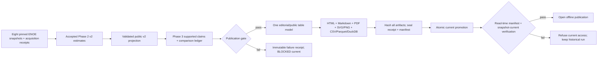

# Phase 4: Offline Publication and Reproducible Operation — Research

**Researched:** 2026-09-22  
**Domain:** static editorial publication, public aggregate exports, sealed local runs  
**Confidence:** MEDIUM (Phases2/3 accepted; Phase4 renderer, exports and installed operation still require implementation and verification)

**Execution readback, 2026-09-23:** Phase 2 is accepted and Phase 3 Plan 03-01 now returns a sanitized `profiles["record_index"]`. This common analysis projection propagates complementary parent redactions. Phase 4 must consume the final validated Phase 3 packet and that projection; rebuilding the original public projection directly from numerical estimates would restore those additional redactions. The accepted 03-02/03 interfaces and persisted JSON handoff are now verified in 04-UPSTREAM-PREFLIGHT.md.

## User Constraints

This research preceded the now-present `04-CONTEXT.md` and `04-EDITORIAL-SPEC.md`; those reviewed decisions govern execution. The following authorized constraints come from `AGENTS.md`, `.planning/PROJECT.md`, `.planning/ROADMAP.md`, `.planning/REQUIREMENTS.md`, and Phase 3's locked context. [VERIFIED: local project files]

### Locked decisions

- Deliver the **complete real ENOE** publication for eight quarters, with three focal fields, national context, coverage and limitations; synthetic v0.1.0 is a regression fixture, not completion. [VERIFIED: `.planning/PROJECT.md`; `.planning/ROADMAP.md`]
- Produce Spanish, question-led **offline HTML, equivalent Markdown, printable PDF, SVG/PNG figures, semantic tables, and CSV/Parquet/DuckDB aggregates** from one accepted public v2 projection. No frontend, backend, hosted service, JavaScript dependency, credentials, or network resources. [VERIFIED: `AGENTS.md`; `.planning/REQUIREMENTS.md`; `03-CONTEXT.md`]
- Preserve distinct field, occupation, industry, geography, period, source and population; null stays null. Suppression, uncertainty, evidence and source terms remain visible. [VERIFIED: `AGENTS.md`; `docs/CONTRACT-V2.md`]
- Seal receipt, artifacts and manifest **before** atomic `current` promotion. A failed run or later failed acquisition invalidates dependent current access without erasing historical runs. [VERIFIED: `AGENTS.md`; `docs/CONTRACT.md`; `.planning/REQUIREMENTS.md`]
- Use free local dependencies. GitHub release publication to `erickinorganico/career-signals-mx` is authorized after secret/license review, but release audit belongs to Phase 5. Do not publish microdata. [VERIFIED: `AGENTS.md`; `.planning/ROADMAP.md`]
- Keep Phase 3 claim IDs and exact public estimate/source/method references; fewer than three opening findings are valid when evidence is limited. [VERIFIED: `03-CONTEXT.md`]

### Agent discretion

- Choose module layout, immutable file names, editorial CSS and figure design after inspecting the accepted Phase 2/3 outputs. [VERIFIED: `03-CONTEXT.md`; `.planning/ROADMAP.md`]
- Prefer a compact standard-library serializer for Markdown/HTML/CSV and the existing DuckDB/Matplotlib stack; add WeasyPrint 70.0 for PDF as already proven locally. [VERIFIED: `pyproject.toml`; `.planning/research/PDF-PROBE.md`]

### Deferred ideas (out of scope)

- A web application, service, hosting, new source, deflator, causal model, personalized recommendation, and Phase 5 release audit are outside this phase. [VERIFIED: `AGENTS.md`; `.planning/ROADMAP.md`; `03-CONTEXT.md`]

<phase_requirements>

## Phase Requirements

| ID | Description | Research support |
|---|---|---|
| PUB-01 | Question-led Spanish report and supported findings | Single editorial model; fixed coverage sections and traceable claims |
| PUB-02 | Offline HTML/Markdown/PDF parity | Shared report model; restricted local URL fetcher; PDF probe |
| PUB-03 | SVG/PNG and semantic tables | Existing Matplotlib Agg; W3C table semantics; print/zoom gate |
| PUB-04 | CSV/Parquet/DuckDB with public keys | Stable v2 grain ID, dictionary, schema and join checks |
| PUB-05 | One public suppression boundary | Validated Phase 3 sanitized packet, all-format sentinel audit |
| OPS-01 | Refresh and offline numerical replay | Pinned snapshots; content digest excluding run metadata |
| OPS-02 | Sealed run before current promotion | Existing v1 state machine adapted to v2; crash matrix |
| OPS-03 | Verify all inputs and acquisitions on access | Per-snapshot `resolve_snapshot` plus manifest/current checks |

</phase_requirements>

## Project Constraints (from AGENTS.md)

- Read `docs/CONTRACT.md` before interface changes; keep local code, fixtures and isolated tests within the repository. [VERIFIED: `AGENTS.md`]
- No paid APIs, external inference, credentials or third-party messages. Only the named GitHub repository is authorized for public release, and only after secret/license review of synthetic or redistributable public data. [VERIFIED: `AGENTS.md`]
- Deliver research scripts, pipelines, tables, charts, Markdown/HTML reports and evidence; no frontend, backend service or navigable application. [VERIFIED: `AGENTS.md`]
- Keep field, occupation, industry, geography, period and source distinct; null is never inferred as zero; synthetic output remains labeled synthetic. [VERIFIED: `AGENTS.md`]
- Block automatic deltas when source, universe, geography, measure, price basis, method, concept or period changes; show unavailable precision. [VERIFIED: `AGENTS.md`]
- Content-address raw artifacts; every failed refresh leaves a receipt and invalidates current; claims need verified evidence and only validated artifacts may be released. [VERIFIED: `AGENTS.md`]
- Respect contributor file ownership and preserve concurrent edits; do not reuse proprietary data, queries or code from unrelated workspaces. [VERIFIED: `AGENTS.md`]

## Summary

Build Phase 4 around a **single validated public v2 document**. Phase 3's accepted claims, comparison ledger and coverage attach to that document by stable keys. An editorial representation then drives HTML, Markdown, PDF, figures and public tables. Internal `estimate` values and diagnostic payloads never enter render or export functions. This follows the existing v2 allowlist projection, whose suppressed rows null the estimate-derived denominator, support total, SE, CV and CI while keeping observed support and reason. [VERIFIED: `brujula/research_contract.py`; `docs/CONTRACT-V2.md`; `03-CONTEXT.md`]

The existing v1 `pipeline.py` is the operational pattern, not a reusable data shape: it already stages immutable run files, hashes them, seals a receipt and manifest, then atomically replaces `current.json`; `resolve_current` verifies hashes before opening reports. Its bundle, export and report inputs remain synthetic v1. The v2 publisher should keep the state machine and introduce a v2-specific bundle/manifest contract, all-artifact verification, and **live resolution of each required acquisition current**. [VERIFIED: `brujula/pipeline.py`; `brujula/export.py`; `brujula/report.py`; `brujula/acquisition.py`]

The project-local PDF probe has already rendered Spanish text, inline SVG, an 80-row table and page numbering using WeasyPrint 70.0 on Windows with local Pango/Fontconfig. Use that result; do not repeat the download. The final real report still needs full output parity and visual review, including Ubuntu. [VERIFIED: `.planning/research/PDF-PROBE.md`; CITED: https://doc.courtbouillon.org/weasyprint/latest/first_steps.html]

**Primary recommendation:** Implement one sealed v2 publication builder whose only numerical input is the validated Phase 3 analysis packet and its sanitized `record_index`, and make every reader resolve the sealed manifest **and** current status of all eight required acquisitions. [VERIFIED: `brujula/research_contract.py`; `brujula/acquisition.py`; `docs/CONTRACT.md`]

## Architectural Responsibility Map

| Capability | Primary tier | Secondary tier | Rationale |
|---|---|---|---|
| Suppression and release eligibility | Local batch publisher | v2 contract | Validate once before fan-out. [VERIFIED: `docs/CONTRACT-V2.md`] |
| Editorial report and figures | Local batch renderer | Static artifacts | No runtime browser/service logic. [VERIFIED: `AGENTS.md`] |
| CSV/Parquet/DuckDB exports | Local batch exporter | Local DuckDB file | All write from the same public rows. [VERIFIED: `brujula/export.py`; `03-CONTEXT.md`] |
| Snapshot custody and freshness | Local acquisition registry | Immutable ZIP cache | Each snapshot has its own receipt and current. [VERIFIED: `brujula/acquisition.py`] |
| Current publication resolution | Local batch resolver | Filesystem | Hashes and acquisition state must pass at read time. [VERIFIED: `brujula/pipeline.py`; `.planning/REQUIREMENTS.md`] |

## Standard Stack

| Component | Version / status | Use | Evidence |
|---|---|---|---|
| Python | 3.12+ project contract | CLI, deterministic orchestration, JSON/CSV/HTML escaping | [VERIFIED: `docs/CONTRACT.md`; `pyproject.toml`] |
| DuckDB | pinned `1.4.4` | Public `.duckdb` and Parquet `COPY`; inspect relational types/nulls | [VERIFIED: `pyproject.toml`; `brujula/export.py`; CITED: https://duckdb.org/docs/lts/guides/file_formats/parquet_export] |
| Matplotlib | pinned `3.10.8` | Agg-rendered SVG/PNG from public rows | [VERIFIED: `pyproject.toml`; `brujula/report.py`] |
| jsonschema | pinned `4.26.0` | Strict internal/public v2 and sealed manifest schemas | [VERIFIED: `pyproject.toml`; `brujula/research_contract.py`] |
| WeasyPrint | **70.0, Phase 4 addition** | Local HTML to printable PDF; custom restricted fetcher | [VERIFIED: `.planning/research/PDF-PROBE.md`; CITED: https://doc.courtbouillon.org/weasyprint/stable/api_reference.html] |
| pytest | pinned `9.0.3`, test extra | Cross-format and crash tests | [VERIFIED: `pyproject.toml`] |

**Package legitimacy audit (refreshed 2026-09-22):** Direct [PyPI version metadata](https://pypi.org/pypi/weasyprint/70.0/json) and the [official release](https://github.com/Kozea/WeasyPrint/releases/tag/v70.0) confirm `weasyprint==70.0`, Python >=3.10, BSD licensing, the Kozea source repository and a non-yanked release. The wheel SHA-256 is `5043e55e38d2a2af2b2b871e869697b1f65dad5f8b4a3677961d04ceacf9c5fe`; sdist SHA-256 is `c263abf0e86c747b12af678b67f85f4abbfb97d18a20503031e7ba94e4b8cf8c`. The registry identity/provenance gate is satisfied by primary evidence. Optional `slopcheck` is unavailable; that is not an additional authorization gate. Actual installation must use the explicit project interpreter/uv and verify downloaded artifacts; dependency resolution and clean Windows/Ubuntu PDF behavior remain execution checks.

The Windows probe used a verified official onedir build solely as a DLL source and a separate Python 3.12.13 `weasyprint==70.0` environment; document a bounded `WEASYPRINT_DLL_DIRECTORIES`/Fontconfig setup or official MSYS2/Pango setup. Ubuntu needs a clean Pango install and PDF render gate. Do not change machine-wide PATH or silently depend on Codex's PDF interpreter. [VERIFIED: `.planning/research/PDF-PROBE.md`; CITED: https://doc.courtbouillon.org/weasyprint/latest/first_steps.html]

## Architecture Patterns



### Recommended component boundaries

| Component | Responsibility | Existing seam |
|---|---|---|
| v2 publication model | Validate public projection; attach typed claims/comparisons; create stable record/figure/claim IDs | `brujula/research_contract.py`; Phase 3 outputs pending |
| renderer | Render fixed Spanish sections and common tables into HTML/Markdown; PDF consumes same HTML; charts consume same typed figure specs | `brujula/report.py` is v1-only |
| exporter | Serialize public rows and dictionary to CSV/Parquet/DuckDB; preserve `NULL`, units, provenance and join keys | `brujula/export.py`, `brujula/warehouse.py` are v1-only |
| v2 run builder | Stage, verify, seal, atomically promote; record failure without overwriting final receipt | `brujula/pipeline.py`; `brujula/runlock.py` |
| resolver/CLI | Verify run manifest, public schema, exact acquisition receipts/status and source hashes before returning paths | `resolve_current`; `resolve_snapshot`; `brujula/cli.py` |

**Stable ID:** Derive a canonical record key from the ten fields in `GRAIN`, plus an explicit key version, using length-safe canonical JSON and SHA-256; the v2 record has no built-in `id`. Use the same key in CSV, Parquet, DuckDB, table footnotes, figure metadata and claim references. Keep snapshot SHA-256 and method version as columns/metadata; never use display labels as join keys. [VERIFIED: `brujula/research_contract.py`; `docs/CONTRACT-V2.md`; `03-RESEARCH.md`]

**Determinism boundary:** Sort public records and catalog entries by canonical IDs, pin input snapshot hashes, schema/method versions, rounding policy, tool versions and locale. Compute a `numerical_content_sha256` from canonical unrounded public numerical records plus accepted comparison/claim identifiers, excluding `run_id`, receipt times, acquisition timestamps and file container metadata. Replay asserts this digest and row-level values; byte-identical PDF/PNG/Parquet/DuckDB files are **not** the numerical reproducibility contract. [ASSUMED: recommended digest definition; VERSIONED design decision required before implementation]

**Publication order:** under one build lock, write `current=RUNNING`, resolve and pin all eight acquisition receipts/hashes, create immutable run staging, validate the complete public projection and every output, seal final receipt and manifest of relative file hashes, then atomically replace `current` with the manifest digest. On any error, retain an immutable failure receipt and replace current with `BLOCKED`; never rewrite a sealed success receipt. Read-time resolution rechecks the manifest **and** `resolve_snapshot` for every required snapshot, comparing current acquisition receipt identity/hash to the sealed dependencies. [VERIFIED: `brujula/pipeline.py`; `brujula/acquisition.py`; `.planning/REQUIREMENTS.md`; ASSUMED: v2 manifest field naming]

**Offline PDF:** render local HTML with `HTML(filename=..., url_fetcher=LocalOnlyFetcher(...)).write_pdf(...)`; restrict assets to a manifest-authorized run subtree, reject network/data URLs and path traversal, and make missing resource errors fatal. The official WeasyPrint fetcher can access HTTP and local files by default and may convert ordinary fetch errors to warnings; configure fatal rejection and test it. [CITED: https://doc.courtbouillon.org/weasyprint/latest/first_steps.html; https://doc.courtbouillon.org/weasyprint/stable/api_reference.html]

**Tables and figures:** use real `<table>`, `<caption>`, `<th scope>`, headings and per-figure explanatory text/alternative table. Put state, units, IC90/CV where released, universe, period and source in captions/notes as text, not color alone. Keep SVG/PNG and the alternative table derived from one figure specification. W3C WAI documents header/cell associations and captions; the final PDF must be checked because conversion can lose table semantics. [CITED: https://www.w3.org/WAI/tutorials/tables/; VERIFIED: `.planning/REQUIREMENTS.md`]

**Editorial acceptance:** a finished report needs an opening that answers a concrete labor question, no more than three supported findings, national context, full focal profiles, eight-quarter evolution, territory and recorded-sex slices, and method/source appendices. Display suppressed cells with reasons. A raw table dump or synthetic demo does not satisfy the release brief. Verify licensed local font assets or use documented system fonts; every HTML/PDF resource must remain available offline. [VERIFIED: `.planning/PROJECT.md`; `.planning/REQUIREMENTS.md`; `03-CONTEXT.md`; `.planning/research/PDF-PROBE.md`]

## Don't Hand-Roll

| Problem | Use | Reason |
|---|---|---|
| PDF layout, pagination, font shaping | WeasyPrint 70.0 | Existing Spanish/table/SVG probe and official print API. [VERIFIED: `.planning/research/PDF-PROBE.md`] |
| Columnar Parquet format | DuckDB `COPY ... (FORMAT PARQUET)` | Existing dependency and official export feature. [CITED: https://duckdb.org/docs/lts/guides/file_formats/parquet_export] |
| Raster/vector charts | Existing Matplotlib Agg | Existing chart seam; avoid bespoke SVG numeric labels. [VERIFIED: `brujula/report.py`] |
| Statistical suppression | Existing v2 projection and Phase 2 gate | Duplicated renderer filters can leak diagnostics. [VERIFIED: `brujula/research_contract.py`] |
| Multi-writer lock | Existing `BuildLock` | Existing crash-aware filesystem state. [VERIFIED: `brujula/runlock.py`] |

## Common Pitfalls

| Failure | Planning gate |
|---|---|
| Renderer/exporter receives internal `estimate` or diagnostic bundle | Type/validate the sole public input; prohibit internal payload at module boundary; use nested sentinel values across every format including alt text and PDF extraction. [VERIFIED: `docs/CONTRACT-V2.md`] |
| Suppressed point is null but SE, CI, weighted denominator, total or derived comparison reveals it | Test all nested fields plus complementary aggregates and claim prose; block a derivable cell or its complement when needed. [VERIFIED: `docs/CONTRACT-V2.md`; `03-CONTEXT.md`] |
| Export files exist after a later failed render or PDF step | Treat staged files as historical diagnostics only; no public links until sealed current; resolver rejects blocked run. [VERIFIED: `docs/CONTRACT.md`] |
| A later snapshot acquisition fails but an older run still resolves as current | Read all sealed dependency IDs via `resolve_snapshot` on every open; failed/mismatched acquisition current blocks. [VERIFIED: `brujula/acquisition.py`; `.planning/REQUIREMENTS.md`] |
| Manifest hashes include mutable journal, or manifest path escapes run | Exclude journal/current, require exact expected file set, reject absolute/`..`/backslash/symlink escapes, hash all public files. [VERIFIED: `brujula/pipeline.py`] |
| Run ID/timestamp changes cause false replay failure | Compare canonical numeric digest and exact record values; keep operational metadata separately. [ASSUMED: recommended replay contract] |
| Markdown/HTML/PDF disagree in headings, numbers or limitations | Generate one section/claim model and assert semantic parity; PDF text extraction plus visual checks. [VERIFIED: `.planning/REQUIREMENTS.md`] |
| CSV spreadsheet formula injection | Reuse v1 neutralization and test labels/IDs starting `= + - @`; document CSV escaped representation separately from typed Parquet/DuckDB. [VERIFIED: `brujula/export.py`] |
| PDF fetcher silently loads network/local secrets or font differs by platform | Strict local fetcher, fatal missing assets, explicit font/Pango setup, clean Ubuntu/Windows smoke. [CITED: https://doc.courtbouillon.org/weasyprint/latest/first_steps.html; VERIFIED: `.planning/research/PDF-PROBE.md`] |

## Code Examples

```python
# Existing gate, verified in brujula/research_contract.py.
from brujula.research_contract import public_research_projection, validate_public_research_v2

public = public_research_projection(internal_v2)
assert validate_public_research_v2(public) == []
# Pass `public` (and claims already bound to it) to every public serializer.
```

```python
# Pattern supported by official WeasyPrint API; LocalOnlyFetcher is a
# project-defined bounded adapter, not an existing implementation.
from weasyprint import HTML

HTML(filename=str(local_html), url_fetcher=local_only_fetcher).write_pdf(str(local_pdf))
# Source: https://doc.courtbouillon.org/weasyprint/stable/api_reference.html
```

```sql
-- Source: https://duckdb.org/docs/lts/guides/file_formats/parquet_export
COPY (SELECT * FROM public_observations ORDER BY record_id)
TO 'observations.parquet' (FORMAT PARQUET);
```

## State of the Art

| Existing project behavior | Phase 4 target | Impact |
|---|---|---|
| v1 synthetic bundle and report | Separate strict v2 publication bundle | Prevent schema confusion; retain v1 regression. [VERIFIED: `docs/CONTRACT.md`; `docs/CONTRACT-V2.md`] |
| HTML/Markdown + SVG/PNG | Equivalent PDF from same HTML/model | Add local print gate. [VERIFIED: `brujula/report.py`; `.planning/research/PDF-PROBE.md`] |
| v1 CSV/Parquet and warehouse | Public v2 CSV/Parquet/DuckDB with stable grain IDs | Preserve precision/provenance and joins. [VERIFIED: `brujula/export.py`; `.planning/REQUIREMENTS.md`] |
| v1 run verification checks one raw input | v2 resolver checks eight current acquisition receipts | Later failed refresh invalidates dependent current. [VERIFIED: `brujula/pipeline.py`; `brujula/acquisition.py`] |

## Assumptions Log

| # | Assumption | Risk if wrong |
|---|---|---|
| A1 | Proposed `numerical_content_sha256` canonicalization and v2 manifest keys are new design choices. | Define/version exact canonical bytes before replay tests or implementations diverge. |
| A2 | Final Phase 2/3 packets will expose stable versioned method, metric, claim and comparison identifiers needed by the editorial join. | Inspect accepted interfaces before plans; evolve v2 schema if missing. |
| A3 | `weasyprint==70.0` installs with the selected dependencies and native rendering libraries on both systems. | Primary registry identity/hash verified; validate actual installation and render on clean Windows/Ubuntu. Optional slopcheck absence is recorded. |

## Resolved Decisions and Execution Gates

1. **Resolved dependency rule:** inspect the accepted Phase 2/3 implementations and numerical/analysis acceptance ledger before executable Phase 4 sign-off. Bind all render/export adapters to those exact public interfaces; any missing precision/coverage/provenance key is an upstream gap to fix, not a renderer assumption. Phases2/3 acceptance is complete; exact persisted JSON readback and source versions are in04-UPSTREAM-PREFLIGHT.md. [VERIFIED: `.planning/ROADMAP.md`; `03-CONTEXT.md`; `04-CONTEXT.md`]
2. **Resolved suppression scope:** the publisher must never fill a suppressed null by a complement or reconstruct an unsupported direct measure from other records. Displayed direct measures bind to supported public records; differences require the validated comparison contract. Tests inject a reconstructed complementary cell and require rejection across the output packet. The public-survey precision contract does not promise confidentiality or general resistance to algebraic inference from all released aggregates; do not invent that stronger requirement or silently claim it. [DECISION: `04-CONTEXT.md`; PUB-05 public-output boundary]
3. **Resolved accessibility claim:** semantic HTML tables, alternatives, contrast/zoom and visually inspected/searchable PDF are required. Successful rendering does not establish PDF/UA certification or screen-reader conformance; make only the claims that receive explicit final tests. No formal PDF certification is assumed. [DECISION: `04-CONTEXT.md`; VERIFIED: `.planning/research/PDF-PROBE.md`; CITED: https://www.w3.org/WAI/tutorials/tables/]

## Environment Availability

| Dependency | Required by | Current evidence | Action |
|---|---|---|---|
| Python 3.12.13 project runtime | CLI/tests | Probe environment exists, but shell `python` pyenv shim is unselected | Use project `.venv`/explicit interpreter in plans. [VERIFIED: local tool probe; `pyproject.toml`] |
| DuckDB/Matplotlib/jsonschema | Existing package | Pinned in `pyproject.toml` and tests | Reuse. [VERIFIED: local files] |
| WeasyPrint 70.0 + Pango/Fontconfig | PDF | Windows project-local probe succeeded | Add explicit optional/runtime installation and clean Ubuntu check. [VERIFIED: `.planning/research/PDF-PROBE.md`] |
| Eight accepted ENOE snapshots + Phase 2/3 packets | Real report | Eight acquired snapshots, Phase2 numerical replay and Phase3 persisted analytical packet accepted | Block publication until upstream gates pass. [VERIFIED: `.planning/PROJECT.md`; `.planning/ROADMAP.md`] |

## Validation Architecture

| Property | Value |
|---|---|
| Framework | `pytest==9.0.3`, `pyproject.toml`; current `tests/test_report.py`, `test_export.py`, `test_pipeline.py`, `test_acquisition.py`, `test_research_contract.py`. [VERIFIED: local files] |
| Quick run | Explicit project interpreter `-m pytest tests/test_publication_v2.py tests/test_export_v2.py tests/test_pipeline_v2.py -q` after Wave 0. [ASSUMED: planned filenames] |
| Full suite | Explicit project interpreter `-m pytest -q`; then real offline replay and PDF inspection. [VERIFIED: `pyproject.toml`; `.planning/REQUIREMENTS.md`] |

| Requirement | Essential automated check |
|---|---|
| PUB-01 | Fixed question-led sections, up to 3 supported opening claims, all 8 quarters, three profiles, 32-state coverage and limitation notes; each claim resolves IDs. |
| PUB-02 | Air-gapped HTML/Markdown/PDF render from one public model; heading, claim, number, source and caveat parity; PDF accents, table pagination, headers and page counters; no external URL loads. |
| PUB-03 | SVG/PNG pair and alternate semantic table for every figure; exact plotted point/alt/table parity, caption/unit/IC90/status/universe/source checks; visual print/mobile/200% review records no clipping. |
| PUB-04 | Round-trip CSV, Parquet, DuckDB into typed expected rows and nulls; dictionary, foreign keys and record/figure/claim joins; formula-prefix cases. |
| PUB-05 | Deliberately suppressed internal point plus nested denominator/SE/CI sentinels and complement case absent from HTML, MD, extracted PDF text, SVG, PNG metadata/alt, CSV, Parquet and DuckDB. |
| OPS-01 | Two offline runs from same eight pinned ZIPs yield identical canonical numerical digest and rows despite different run IDs/timestamps; changed ZIP or method version changes dependency digest. |
| OPS-02 | Fault injection at each stage (input, export, PDF, receipt, manifest, pointer, post-pointer index) leaves immutable receipt/history and correct current state; manifest corruption/path escape fails. |
| OPS-03 | After sealed success, fail one required snapshot acquisition; resolver rejects current; restore via a new successful verified attempt before access resumes; unrelated snapshot does not silently authorize it. |

**Wave 0 gaps:** Add focused v2 publication/export/pipeline tests and typed aggregate fixtures after final Phase 2/3 interfaces; keep tests disposable and free of public person rows. Run focused tests per task, full suite per wave, and an accepted real eight-snapshot offline replay at phase gate. [VERIFIED: `AGENTS.md`; `.planning/ROADMAP.md`; ASSUMED: test file names]

## Security Domain

| ASVS category | Applies | Control |
|---|---|---|
| V2 authentication / V3 sessions | No | Offline CLI and static artifacts have no account/session surface. [VERIFIED: `AGENTS.md`] |
| V4 access control | Yes, data boundary | Only the validated public projection reaches release artifacts; local microdata stays outside manifest. [VERIFIED: `AGENTS.md`; `docs/CONTRACT-V2.md`] |
| V5 input validation/output encoding | Yes | Strict v2 schema, HTML escaping, CSV formula neutralization, safe artifact paths, local-only PDF fetcher. [VERIFIED: `brujula/research_contract.py`; `brujula/export.py`; `brujula/pipeline.py`; CITED: https://doc.courtbouillon.org/weasyprint/latest/first_steps.html] |
| V6 cryptography | Yes, integrity | Standard-library SHA-256 for snapshots, artifacts and manifest; never invent a hash algorithm. [VERIFIED: `brujula/acquisition.py`; `brujula/pipeline.py`] |

STRIDE risks are information disclosure (suppressed diagnostic cells, microdata, PDF local-file access), tampering (snapshot/manifest replacement), and spoofed current success after failure. Validate the public boundary, restrict renderer resources, verify hashes and acquisition receipts on every open, and fail closed. [VERIFIED: `AGENTS.md`; `brujula/pipeline.py`; `brujula/acquisition.py`; CITED: https://doc.courtbouillon.org/weasyprint/latest/first_steps.html]

## Sources

**Primary local:** `AGENTS.md`, `docs/CONTRACT.md`, `docs/CONTRACT-V2.md`, `.planning/{PROJECT,REQUIREMENTS,ROADMAP}.md`, `.planning/phases/03-supported-labor-findings/{03-CONTEXT,03-RESEARCH}.md`, `.planning/research/PDF-PROBE.md`, `brujula/{acquisition,research_contract,pipeline,runlock,report,export,warehouse,cli,resources}.py`, `pyproject.toml`, and existing tests. [VERIFIED: local reads]

**Primary official:** [WeasyPrint 70 API](https://doc.courtbouillon.org/weasyprint/stable/api_reference.html), [WeasyPrint first steps and resource security](https://doc.courtbouillon.org/weasyprint/latest/first_steps.html), [DuckDB Parquet export](https://duckdb.org/docs/lts/guides/file_formats/parquet_export), [DuckDB COPY statement](https://duckdb.org/docs/lts/sql/statements/copy), [W3C WAI tables tutorial](https://www.w3.org/WAI/tutorials/tables/), [official WeasyPrint v70.0 release](https://github.com/Kozea/WeasyPrint/releases/tag/v70.0). [CITED: linked official documentation]

## Metadata

**Confidence breakdown:** existing contracts/operational seams HIGH; PDF feasibility HIGH on probed Windows, MEDIUM for clean Ubuntu; accepted v2 shape and deterministic analysis digest HIGH after Phase3 verification; package registry identity HIGH after the direct PyPI/release check, installation compatibility pending.
**Valid until:** 2026-10-22 or earlier if Phase 2/3 interfaces, WeasyPrint API or package versions change.
