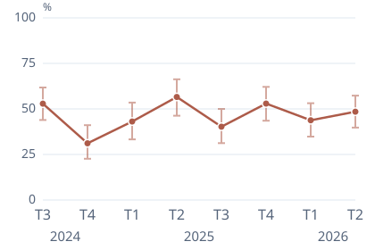
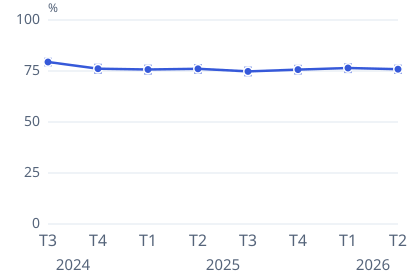
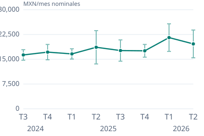

# Brújula Laboral MX

### ¿Qué muestra la ENOE sobre estudiar Derecho, Comunicación o Ciencias políticas?

Investigación reproducible del mercado laboral mexicano. Ocho trimestres de datos públicos, gráficas y tablas con evidencia para leer cada cifra en su contexto.

**[Explorar los resultados →](https://erickinorganico.github.io/career-signals-mx/)** · [Leer el informe completo](https://erickinorganico.github.io/career-signals-mx/research/report.html) · [Descargar PDF](https://github.com/erickinorganico/career-signals-mx/releases/download/v1.0.0/brujula-laboral-mx-informe.pdf) · [English](README.en.md)

| Periodo analizado | Publicación | Material disponible |
|---|---|---|
| 2024-T3 a 2026-T2 | Versión 1.0.0 | 97 páginas · 9 grupos de gráficas · 22 tablas |

> **Cómo leer los resultados.** Estimaciones del proyecto a partir de la ENOE de INEGI; precisión **no oficial, REVIEW**. Los campos de estudio no equivalen a ocupaciones. Este estudio describe poblaciones y no constituye un ranking ni una recomendación personal.

## Tres resultados para empezar

Las gráficas muestran ocho trimestres con intervalos del 90 %. Debajo se describe el último trimestre. [Explorar las nueve series y sus tablas](https://erickinorganico.github.io/career-signals-mx/#evolucion).

México, segundo trimestre de 2026. Los tres perfiles corresponden a personas con estudios profesionales terminados y edad conocida de 15 años o más (97 significa 97 o más). Las medidas tienen denominadores distintos: no se deben comparar entre sí como si fueran un mismo indicador.

### Ciencias políticas: la cobertura del ingreso también es un resultado

**48.48%** de las personas ocupadas del perfil tienen ingreso exacto positivo conocido. Esta cobertura limita la interpretación del ingreso medio: quienes carecen de ingreso conocido no se convierten en ceros.

IC90: **39.77–57.29%** · CV: 11.10% · n observado: 238 · evidencia **R1549** en el [informe completo](https://erickinorganico.github.io/career-signals-mx/research/report.html).

### Derecho: 75.86% de ocupación en la población del perfil

La tasa de ocupación se calcula sobre la población elegible del perfil; no mide colocación de recién egresados ni empleo relacionado con la carrera.

IC90: **74.00–77.63%** · CV: 1.45% · n observado: 4,507 · evidencia **R0691** en el [informe completo](https://erickinorganico.github.io/career-signals-mx/research/report.html).

### Comunicación y periodismo: $19,647.34 de ingreso mensual medio

**Pesos mexicanos nominales**, exclusivamente entre personas ocupadas con ingreso exacto positivo conocido. No es el ingreso de toda la población del perfil, una oferta salarial ni una medida ajustada por inflación.

IC90: **$15,436.93–$23,857.75** · CV: 13.03% · n observado: 275 · evidencia **R0060** en el [informe completo](https://erickinorganico.github.io/career-signals-mx/research/report.html).

## Explorar toda la investigación

| Pregunta | Dónde leer |
|---|---|
| ¿Qué muestran los tres campos y su evolución? | [Sitio de resultados](https://erickinorganico.github.io/career-signals-mx/) |
| ¿Qué ocurre por sexo registrado, entidad y otros campos? | [Informe completo con todas las tablas](https://erickinorganico.github.io/career-signals-mx/research/report.html) |
| ¿Cómo se calcularon las cifras y sus límites? | [Metodología](docs/METHODOLOGY.md) y [fuentes](docs/SOURCES.md) |
| ¿Cómo descargar, comprobar y reproducir? | [Publicación 1.0.0](https://github.com/erickinorganico/career-signals-mx/releases/tag/v1.0.0) y [guía de operación](docs/OPERATIONS.md) |

Los perfiles nacionales y los tres campos focales tienen ocho trimestres de seguimiento. Otros campos, sexo registrado y las 32 entidades se presentan para el último trimestre. El contexto nacional de 15 años o más tiene un universo distinto al de estudios profesionales terminados. Los valores faltantes o suprimidos permanecen `null`; los cambios de universo, fuente, método o base de precios bloquean comparaciones automáticas.

## Descargar y reproducir

El [ZIP de investigación](https://github.com/erickinorganico/career-signals-mx/releases/download/v1.0.0/brujula-laboral-mx-investigacion.zip) contiene HTML para consulta offline, Markdown, PDF, gráficas, exportaciones CSV/Parquet/DuckDB y manifiesto de integridad. Extráelo y abre `research/report.html`. No incluye microdatos.

Para reproducir desde fuentes custodiadas, usa `enoe-accept`, `research-analyze`, `research-build`, `research-replay` y `research-open` siguiendo la [guía bilingüe](docs/OPERATIONS.md). El sitio estático distribuye los archivos del release y verifica sus hashes antes de publicar; [cómo se construye](docs/PAGES.md).

## Evidencia y alcance

La publicación contiene **6,739 registros evaluados, 4,209 comparaciones y 38 afirmaciones vinculadas a evidencia**. Las comparaciones no admisibles quedan bloqueadas. La [CI del código publicado](https://github.com/erickinorganico/career-signals-mx/actions/runs/36464796584) pasó 595 pruebas Python (seis casos requieren el entorno local) y 30 controles Node en Windows y Ubuntu. El [recibo de aceptación](docs/evidence/phase-05-release-acceptance.json) distingue pruebas, auditoría, aprobación visual y verificación de descargas.

- [Alcance](docs/SCOPE.md), [contrato de investigación](docs/CONTRACT-V2.md) y [arquitectura](docs/ARCHITECTURE.md).
- [Aceptación numérica](docs/evidence/phase-02-numerical-acceptance.json), [analítica](docs/evidence/phase-03-analysis-acceptance.json) y [estado GSD](.planning/STATE.md).
- [Contribuir](CONTRIBUTING.md), [citar](CITATION.cff) y [piloto sintético histórico](examples/synthetic/README.md).

Fuente: INEGI, Encuesta Nacional de Ocupación y Empleo. Selección, estimación y transformación de Brújula Laboral MX, no realizadas ni avaladas por INEGI. Código y contenido original bajo [MIT](LICENSE); los materiales externos conservan sus [condiciones y atribución](THIRD_PARTY_NOTICES.md).
