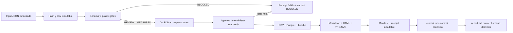

# Arquitectura de Brújula Laboral MX

> **Arquitectura histórica del piloto sintético 0.1.0.** La arquitectura real 1.0.0 está en implementación conforme al [roadmap activo](../.planning/ROADMAP.md) y [CONTRACT-V2](CONTRACT-V2.md). La mención de M6 como extensión condicional describe el alcance anterior.

Estado del documento: especificación implementable, 2026-09-22. Este documento
distingue capacidades presentes en el checkout de capacidades aceptadas o
planeadas. Una decisión aceptada no prueba que el código exista ni que el E2E
esté verde.

## Propósito y frontera

Brújula Laboral MX es un repositorio de investigación reproducible. Convierte
inputs autorizados en tablas, comparaciones, gráficas y reportes estáticos con
evidencia. La interacción es por CLI, archivos y artefactos. No hay aplicación,
frontend, backend, API HTTP, servidor ni estado multiusuario.

El piloto usa datos sintéticos para tres campos de estudio, tres periodos, dos
geografías y tres métricas. La ENOE real pertenece a M6 y permanece bloqueada
hasta validar licencia, clasificación, ponderación, varianza y precisión.

## Estado actual comprobado

| Superficie | Estado actual | Evidencia local | Falta para cerrar |
|---|---|---|---|
| Contrato del dataset | Implementado | `contracts/dataset.schema.json` | revisión E2E limpia |
| Fixture sintético | Implementado | `data/fixtures/pilot.json` | revisión E2E limpia |
| Loader y quality | Implementado localmente | `brujula/data.py`, `brujula/quality.py` | revisión E2E limpia |
| DuckDB | Parcial | `brujula/warehouse.py` | constraints lógicos/FK verificados y exports completos |
| Pipeline y receipts | Implementado localmente | `brujula/pipeline.py`, `brujula/runlock.py` | revisión E2E limpia |
| Source Scout | Parcial | `brujula/scout.py` | revisión de política de red y ejecución opt-in |
| Agentes read-only | Implementado localmente | `brujula/agents.py`, `contracts/agent-run.schema.json` | revisión E2E limpia |
| Reportes/gráficas | Implementado localmente | `brujula/report.py` | revisión visual/E2E limpia |
| CLI | Implementado localmente | `brujula/cli.py` | revisión E2E limpia |
| Verificación integral | No demostrada | tests declaran expectativas | una colección verde todavía no constituye evidencia disponible |

## Flujo objetivo



El orden es una frontera de seguridad: un renderer nunca recibe datos que no
pasaron contratos, relaciones, quality y gate agentic. Un fallo actualiza el
puntero `current` a `BLOCKED`; no reutiliza un éxito histórico como si fuera el
resultado vigente.

## Componentes y contratos

### Entrada y raw

`brujula.data.load_dataset(path) -> dict` lee JSON local y valida Draft 2020-12.
El pipeline limita el input, calcula SHA-256 y lo copia una sola vez a
`artifacts/raw/<sha256>.json`. Si el mismo nombre content-addressed contiene
bytes distintos, falla cerrado.

### Quality y comparabilidad

`validate_dataset(dataset, as_of) -> quality` valida schema, IDs, referencias,
grain, rangos, coherencia métrica/unidad/precio, fuentes aprobadas, evidence
refs, bridges y freshness. Los estados públicos son únicamente `MEASURED`,
`REVIEW`, `UNKNOWN`, `BLOCKED`; valores sintéticos no nulos son `REVIEW`.

La API implementada
`compare_observations(previous,current,periods_by_id)` solo calcula delta si coinciden:
concepto/tipo, geografía, métrica, unidad, población, metodología, base de
precios, fuente y bandera sintética; los periodos deben ser distintos y
`current.start>previous.end` según el mapa de periodos. `null`, `UNKNOWN` o
`BLOCKED` impiden delta. Un valor previo cero
admite diferencia absoluta y deja cambio relativo en `null`.

### Warehouse DuckDB

DuckDB es una materialización por ejecución, no la autoridad primaria. Sus
tablas objetivo son:

| Tabla | Grain / PK | Relaciones lógicas |
|---|---|---|
| `dim_field` | una fila por `field_id` | referenciada cuando `concept_type=field_of_study` |
| `dim_occupation` | una fila por `occupation_id` | referenciada cuando `concept_type=occupation` |
| `dim_industry` | una fila por `industry_id` | solo bridge en v1 |
| `dim_geography` | una fila por geografía | `observation.geography_id` |
| `dim_period` | una fila por periodo | `observation.period_id`; start ≤ end |
| `metric` | una fila por métrica | define unidad y base de precio canónicas |
| `source` | una fila por fuente activa del dataset | `observation.source_id`; distinta del catálogo candidato |
| `bridge` | una fila por relación explícita | endpoints polimórficos; siempre `REVIEW` en v1 |
| `observation` | una fila por concepto×geo×periodo×métrica | PK `id`; grain único; refs a dimensiones/source/metric |

DuckDB no debe unir automáticamente campos con ocupaciones. El bridge almacena
`from_type`, `from_id`, `to_type`, `to_id`, método, confianza y evidencia. Sus
labels canónicos provienen de la dimensión correspondiente, no de texto libre
del bridge.

### Capa agentic

Los roles Source Scout, Schema Mapper, Data Quality Guardian, Insight Analyst,
Visualization Planner y Publisher son funciones deterministas y read-only. El
“Publisher” decide si un bundle/reporte puede generarse; no publica a GitHub ni
activa fuentes. GitHub es una operación externa del flujo de desarrollo.

Ningún agente calcula métricas, altera DuckDB, promueve fuentes, aprueba bridges
o convierte una propuesta en dato. `run_agents(dataset, quality, comparisons,
catalog) -> dict` y `validate_agent_run(...) -> list[str]` son el límite público
implementado. Los schemas de insights y agent-run se validan antes del sellado.

### Reportes

`render_report(payload, output_dir) -> dict` crea `report.md`, `report.html` y
una lista de gráficas
PNG/SVG con Matplotlib no interactivo. HTML es un documento estático: sin
JavaScript, CDN, tracking, fuentes remotas ni servidor.

## Layout de artefactos

```text
artifacts/
  current.json                 # puntero vigente; éxito o BLOCKED
  report.md                    # puntero humano vigente
  raw/<sha256>.json            # input inmutable content-addressed
  runs/<run_id>/
    quality.json
    comparisons.json
    agent-run.json
    warehouse.duckdb
    observations.csv
    observations.parquet
    bundle.json
    manifest.json
    receipt.json               # inmutable
    report/report.md
    report/report.html
    report/charts/*.{png,svg}
```

Los archivos de una ejecución exitosa son históricos y auditables. Solo
`current.json` declara cuál ejecución está vigente; `report.md` raíz se deriva de
ese pointer y nunca es autoridad independiente.

## Atomicidad, concurrencia y fallos

- `.build.lock` usa un lock persistente del sistema operativo para impedir dos
  writers; se libera normalmente y la siguiente ejecución recupera un RUNNING
  dejado por crash.
- `current.json` es el único commit canónico. Se escribe por `os.replace` solo
  cuando el run completo está sellado o cuando se registra el fallo vigente.
  `report.md` raíz es una conveniencia humana, nunca autoridad por sí sola.
- El pointer y el journal mutable se actualizan tras calcular el digest del
  input. Generation success se sella antes del commit; un crash posterior al
  commit y anterior a `report.md` deja el `current` válido.
- Staging, exports y reportes parciales dentro del run no son publicables antes
  del commit de `current.json`. El consumidor CLI verifica el pointer, status y
  hashes del run antes de mostrar su reporte. Si el proceso cae entre escrituras
  de `current.json` y `report.md`, se rechaza el índice humano discrepante y
  se regenera desde el JSON canónico. Un consumidor puede resolver directamente
  desde `current.json` si el estado y los hashes son válidos; RUNNING, BLOCKED
  o un puntero inválido no habilitan resultados.
- Raw y receipts inmutables usan create-exclusive; colisión con bytes distintos
  bloquea.
- El primer acto de build invalida el puntero anterior con estado `BLOCKED`.
- Un fallo conserva ejecuciones históricas, pero no ofrece sus cifras como
  actuales.
- Solo una ejecución que terminó gates, exports, reporte y manifest puede mover
  `current.json` a un éxito. Un archivo parcial puede quedar como diagnóstico
  histórico, pero no entra en el conjunto activo.
- Si la generación selló `SUCCEEDED` y falla la publicación, el receipt sellado
  permanece y se escribe `publication-failure.json`; `current` queda BLOCKED.
  Un fallo del índice humano posterior al commit no revoca el éxito canónico.

## Dependencias y despliegue

Python 3.12+, DuckDB, jsonschema, Matplotlib y pytest son suficientes. dbt Core
no es obligatorio en v1; se reconsiderará si el número de modelos y lineage
justifica su costo. No hay hosting obligatorio. GitHub aloja código y únicamente
artefactos/datos cuya redistribución está autorizada.

## Trazabilidad

Esta arquitectura implementa la intención de REQ-001..REQ-018 y los hitos M0–M6.
El mapping requisito por requisito vive en [SPEC.md](SPEC.md). Las decisiones se
registran en [decisions/](decisions/) y sus estados expresan aceptación, no
implementación.
