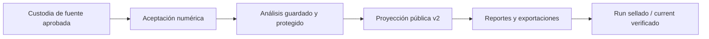

# Guía de arquitectura / Architecture reader guide

> **Estado / Status:** las interfaces de publicación de Fase 4 tienen evidencia de aceptación integrada. La verificación independiente de fase y el release final de Fase 5 siguen abiertos. / Phase 4 publication interfaces have integrated acceptance evidence; independent phase verification and the final Phase 5 release remain open.
>
> **Ancla de fuente / Source anchor:** `docs/evidence/phase-04-publication-acceptance.json` records the installed real publication and hosted Windows/Ubuntu checks. The earlier checkpoint `8353c0a` remains historical planning evidence.

## Español

### Cómo leer el sistema

Brújula Laboral MX es un sistema local de investigación y publicación reproducible. Su frontera principal es una cadena de custodia: una fuente aprobada se congela como bytes verificables; la aceptación numérica aplica el contrato ENOE v2; el análisis usa una proyección pública guardada; y los reportes y exportaciones deben consumir esa misma proyección. No hay arquitectura de aplicación, servicio web ni framework de frontend en este diseño. [A-01]

La flecha representa una dependencia de evidencia, no una autorización automática. Una propuesta de agente no activa una fuente ni un puente. La publicación solo puede usar artefactos validados y una operación aceptada.

### 1. Custodia de fuentes y tiempos de ejecución

`brujula.acquisition.acquire_snapshot` lee el registro aprobado, descarga o reutiliza un ZIP local verificado, valida límites de ZIP y SHA-256, y escribe un recibo inmutable por intento. `resolve_snapshot` exige que el `current.json` mutable sea `SUCCEEDED`, que coincida con el recibo inmutable y que los bytes raw tengan el mismo SHA-256. Los estados `RUNNING`, `FAILED` y `SUCCEEDED` del puntero mutable `current.json` describen el intento vigente; solo el resolver puede convertir un éxito verificable en una referencia utilizable. [A-02]

Hay tres clases de identidad que no deben mezclarse:

| Clase | Qué identifica | Ejemplos | Regla |
|---|---|---|---|
| Contenido fuente/algoritmo/número | Qué datos, código, método y contenido numérico se usaron | SHA del ZIP; código y golden; `numeric_content_digest`; `public_content_sha256` | Puede sostener equivalencia de contenido; no sustituye el reloj de una operación. |
| Clocks y bytes operativos | Qué intento ocurrió, cuándo y qué bytes de artefacto se escribieron | `run_id`, `attempt_id`, `started_at`, `completed_at`, `artifact_hashes` | Describe ejecución y artefactos; no cambia el significado estadístico. |
| Referencia independiente | Qué referencia previamente fijada permite comprobar un candidato | golden, benchmark workbook/PDF, reference packet | Debe resolverse explícitamente; nunca se regenera automáticamente desde el candidato. |

Un recibo inmutable de intento conserva historia. Un `current.json` mutable puede señalar una ejecución `RUNNING`, fallida o exitosa, pero no vuelve exitosa una ejecución fallida. Un resolver verificado comprueba ambos. Un fallo de una adquisición invalida el acceso dependiente correspondiente; no invalida globalmente operaciones no relacionadas.

La corrección de Phase 4 separa el reloj de adquisición del contenido analítico: el raw `public_v2_digest` se verifica operacionalmente, mientras el `source_manifest` analítico usa contenido canónico sin `acquired_at`. Un cambio de reloj no debe cambiar la identidad de contenido; un cambio de fuente, método o valor sí debe bloquear la comparación. [A-03]

### 2. Aceptación numérica

`brujula.enoe_acceptance.accept` ejecuta la aceptación instalada sobre los ocho snapshots aprobados y emite un recibo completo por intento. `replay` repite la computación offline en rutas separadas y compara registros públicos, digest numérico, fuentes, oracle, workbook y PDF contra el recibo aceptado. `docs/evidence/phase-02-numerical-acceptance.json` registra la identidad y el resultado público de aceptación numérica; `docs/evidence/phase-04-publication-acceptance.json` separa esa autoridad de la construcción de informes. [A-04]

El contrato v2 separa `estimate` diagnóstico de `value` autorizado para presentación. `null` significa no disponible, nunca cero. Los estados `MEASURED`, `REVIEW`, `UNKNOWN` y `BLOCKED` conservan su significado contractual; esta guía no hace una afirmación de precisión `MEASURED`. La aceptación actual mantiene el método y sus límites no oficiales, con `REVIEW` donde corresponde. [A-05]

### 3. Análisis protegido y claves de evidencia

`brujula.analysis_v2.index_public_estimates` verifica los payloads públicos aceptados y sus pins. `brujula.findings_v2.build_analysis_packet` construye el paquete analítico persistible; `validate_analysis_packet` vuelve a comprobar digest, fuentes, granos, comparaciones y claims. El paquete real validado contiene 6,739 registros `v2r`, 23 métricas, 4,209 comparaciones `v2c`, 38 claims `v2k` y tres IDs de apertura. Estos conteos describen el paquete validado; no son un resultado de adopción o impacto. [A-06]

Las claves de evidencia conectan cada afirmación con sus datos aceptados:

| Clave | Uso |
|---|---|
| `v2r:<digest>` | Registro público; conserva el grain de fuente, población, campo, ocupación, industria, geografía, sexo, periodo, métrica y método. |
| `v2c:<digest>` | Comparación aceptada entre endpoints; conserva firmas de comparabilidad, periodos, fuentes y motivos. |
| `v2k:<digest>` | Claim canónico; enlaza texto, evidencia, registros/comparaciones y limitaciones. |
| `figure:<slug>` / `table:<slug>` | Referencias editoriales proyectadas; deben resolver a enlaces declarados, nunca crear cifras nuevas. |
| `evidence_refs` | Referencias a la fuente del registro; deben resolver a la misma fuente. |

Las dimensiones de estudio son independientes y nunca se sustituyen entre sí: `field_of_study`, `occupation`, `industry`, `geography` y `period` deben permanecer como claves separadas. Las etiquetas coincidentes no autorizan un join implícito. La cobertura de ocho trimestres aplica al contexto nacional, cohorte profesional y campos focales; otros campos identificables, sexo registrado y las 32 entidades se manejan como detalle del último trimestre, según el alcance aceptado. [A-07]

### 4. Proyección pública, reportes y exportaciones

`brujula.publication_v2.build_publication_model` acepta solo el paquete analítico validado y conserva el índice sanitizado. `validate_publication_model` comprueba el modelo cerrado, digest, enlaces y reconstrucción contra pins independientes. `brujula.export_v2.export_public_tables` escribe el conjunto tipado de **22 tablas relacionales y 46 archivos** (CSV y Parquet por tabla, DuckDB y diccionario), según el inventario real del exportador; la notación “22/46” no inventa nombres de archivo. [A-08]

Los cuatro recursos de fuente tipográfica y el aviso completo que `brujula.resources` reconoce son `DejaVuSans.ttf`, `DejaVuSans-Bold.ttf`, `DejaVuSerif.ttf`, `DejaVuSerif-Bold.ttf` y `LICENSE_DEJAVU`. La publicación real los copió, verificó y selló; la inspección visual y el helper instalado en Windows/Ubuntu comprobaron un PDF en español con DejaVu incrustada. [A-09]

`publication_v2.py`, `export_v2.py`, `report_v2.py`, `pdf_v2.py`, `pipeline_v2.py` y la CLI instalada ya tienen pruebas y evidencia de Fase 4. El run real de 73 artefactos, el informe de 97 páginas, los 22 conjuntos de tablas y la lectura verificada de `current` están documentados en `04-INTEGRATED-OPERATION.md` y el recibo público de Fase 4. La auditoría de release de Fase 5 conserva su propia autoridad. [A-10]

### 5. Estado y límites de release

Cada run sellado separa el recibo inmutable, el manifiesto de bytes, los artefactos y el puntero `current`, e incluye el `analysis.json` sanitizado y validado como entrada editorial reproducible. `research-replay` reconstruye modelo, reportes y exportaciones en una salida nueva y compara contenido lógico/canónico; la recomputación completa de encuesta pertenece a `enoe-replay`. El resolver vuelve a comprobar las ocho adquisiciones requeridas, el manifiesto y cada hash antes de devolver rutas. `research-build` consume un `analysis.json` persistido y trata su `audit_dir` como auditoría numérica de solo lectura; las operaciones `analyze`/`replay` usan destinos de auditoría separados y la publicación escribe bajo `output_root`. Un `FAILED` o `RUNNING` nuevo bloquea el acceso dependiente mientras conserva runs históricos y operaciones no relacionadas.

La CLI, el PDF, el inventario y el sellado tienen evidencia de Fase 4. Existe un release público preliminar `v0.9.0-preview.1`; el inventario final, la lectura pública y la auditoría v1.0.0 pertenecen a Fase 5. La guía no afirma impacto laboral, precisión oficial, servicio de producción ni activación de otra fuente.

## English

### How to read the system

Brújula Laboral MX is a local research and reproducible publication system. Its main boundary is an evidence chain: an approved source is frozen as verifiable bytes; numerical acceptance applies the ENOE v2 contract; analysis uses a persisted public projection; and reports and exports must consume that same projection. The design has no application architecture, web service, or frontend framework. [A-01]

The arrows describe evidence dependencies, not automatic authorization. An agent proposal cannot activate a source or bridge. Publication can use only validated artifacts and an accepted operation.

### 1. Source custody and clocks

`brujula.acquisition.acquire_snapshot` reads the approved registry, downloads or reuses a verified local ZIP, checks ZIP limits and SHA-256, and writes one immutable receipt per attempt. `resolve_snapshot` requires a mutable `current.json` with `SUCCEEDED`, an identical immutable receipt, and raw bytes with the same SHA-256. The mutable current.json pointer describes its current attempt using RUNNING, FAILED or SUCCEEDED; only the resolver can turn a verified success into a usable reference. [A-02]

Three identity classes must remain separate:

| Class | Identifies | Examples | Rule |
|---|---|---|---|
| Source/algorithm/numeric content | Which data, code, method, and numeric content were used | ZIP SHA; code and golden; `numeric_content_digest`; `public_content_sha256` | Can support content equivalence; cannot replace an operation clock. |
| Operation clocks and artifact bytes | Which attempt ran, when, and which artifact bytes were written | `run_id`, `attempt_id`, `started_at`, `completed_at`, `artifact_hashes` | Describes execution and artifacts; does not change statistical meaning. |
| Independent reference | Which previously fixed reference checks a candidate | golden, benchmark workbook/PDF, reference packet | Must be resolved explicitly; never regenerated automatically from the candidate. |

An immutable attempt receipt preserves history. A mutable `current.json` may point to a `RUNNING`, failed, or successful attempt, but it cannot make a failed attempt successful. A verified resolver checks both. A failed acquisition invalidates the corresponding dependent access; it does not globally invalidate unrelated operations.

Phase 4 separates acquisition time from analytical content: raw `public_v2_digest` is checked operationally, while the analytical `source_manifest` uses canonical content without `acquired_at`. A clock-only change must not change content identity; a source, method, or value change must block comparison. [A-03]

### 2. Numerical acceptance

`brujula.enoe_acceptance.accept` runs installed acceptance over the eight approved snapshots and emits a complete receipt per attempt. `replay` recomputes offline in separate paths and compares public records, numeric digest, sources, oracle, workbook, and PDF against the accepted receipt. `docs/evidence/phase-02-numerical-acceptance.json` records public numerical acceptance identity; `docs/evidence/phase-04-publication-acceptance.json` keeps that authority separate from report construction. [A-04]

The v2 contract separates diagnostic `estimate` from presentation-authorized `value`. `null` means unavailable, never zero. `MEASURED`, `REVIEW`, `UNKNOWN`, and `BLOCKED` retain their contractual meanings; this guide makes no `MEASURED` precision claim. Current acceptance retains the nonofficial method and its limits, with `REVIEW` where applicable. [A-05]

### 3. Guarded analysis and evidence keys

`brujula.analysis_v2.index_public_estimates` verifies accepted public payloads and pins. `brujula.findings_v2.build_analysis_packet` builds the persistable analytical packet; `validate_analysis_packet` rechecks digest, sources, grains, comparisons, and claims. The validated real packet contains 6,739 `v2r` records, 23 metrics, 4,209 `v2c` comparisons, 38 `v2k` claims, and three opening IDs. These counts describe a validated packet; they are not adoption or impact results. [A-06]

Evidence keys connect each claim to accepted data:

| Key | Use |
|---|---|
| `v2r:<digest>` | Public record; preserves source, population, field of study, occupation, industry, geography, sex, period, metric, and method grain. |
| `v2c:<digest>` | Accepted endpoint comparison; preserves comparability signatures, periods, sources, and reasons. |
| `v2k:<digest>` | Canonical claim; links text, evidence, records/comparisons, and limitations. |
| `figure:<slug>` / `table:<slug>` | Projected editorial references; must resolve to declared links and never create new numbers. |
| `evidence_refs` | Record-level source references; must resolve to the same source. |

Study dimensions remain independent and are never substituted: `field_of_study`, `occupation`, `industry`, `geography`, and `period` stay separate keys. Matching labels do not authorize an implicit join. Eight-quarter coverage applies to national context, the professional cohort, and focal fields; other identifiable fields, recorded sex, and all 32 entities are latest-quarter detail under the accepted scope. [A-07]

### 4. Public projection, reports, and exports

`brujula.publication_v2.build_publication_model` accepts only the validated analytical packet and retains its sanitized index. `validate_publication_model` checks the closed model, digest, links, and reconstruction against independent pins. `brujula.export_v2.export_public_tables` writes the typed set of **22 relational tables and 46 files** (CSV and Parquet per table, DuckDB, and dictionary), according to the actual exporter inventory; “22/46” does not invent filenames. [A-08]

The four font resources and complete notice recognized by `brujula.resources` are `DejaVuSans.ttf`, `DejaVuSans-Bold.ttf`, `DejaVuSerif.ttf`, `DejaVuSerif-Bold.ttf`, and `LICENSE_DEJAVU`. The real publication copied, verified and sealed them; visual review and the installed helper on Windows/Ubuntu confirmed a searchable Spanish PDF with embedded DejaVu. [A-09]

`publication_v2.py`, `export_v2.py`, `report_v2.py`, `pdf_v2.py`, `pipeline_v2.py` and the installed CLI have Phase 4 tests and evidence. The real 73-artifact run, 97-page report, 22 table sets and verified `current` resolution are recorded in `04-INTEGRATED-OPERATION.md` and the public Phase 4 receipt. Phase 5 retains separate release-audit authority. [A-10]

### 5. Release state and limits

Each sealed run separates the immutable receipt, byte manifest, artifacts, and `current` pointer, and includes validated sanitized `analysis.json` as the reproducible editorial input. `research-replay` rebuilds the model, reports, and exports in a fresh output and compares logical/canonical content; full survey recomputation belongs to `enoe-replay`. The resolver rechecks all eight required acquisitions, the manifest, and every file hash before returning paths. `research-build` consumes persisted `analysis.json` and treats its `audit_dir` as read-only numerical audit; `analyze`/`replay` use separate operation audit destinations and publication writes under `output_root`. A new `FAILED` or `RUNNING` attempt blocks dependent access while preserving historical runs and unrelated operations.

The CLI, PDF rendering, inventory and sealing have Phase 4 evidence. A preliminary public release `v0.9.0-preview.1` exists; final v1.0.0 inventory, public readback and audit belong to Phase 5. This guide makes no claim of labor impact, official precision, production service or another activated source.

## Anchors / Anclas

`[A-01]` is the reader entrypoint and custody-to-publication boundary. `[A-02]` covers receipt/current/resolver semantics. `[A-03]` covers content identity versus acquisition clocks. `[A-04]` covers installed numerical acceptance and replay evidence. `[A-05]` covers the v2 value/status boundary. `[A-06]` covers guarded analysis and packet counts. `[A-07]` covers independent dimensions and coverage. `[A-08]` covers the 22-table/46-file exporter. `[A-09]` covers the actual font inventory. `[A-10]` covers verified Phase 4 renderer, PDF, CLI and sealed operation.
