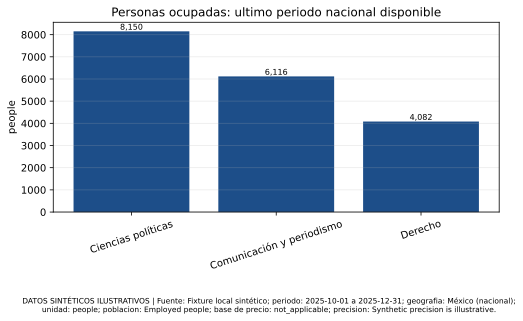
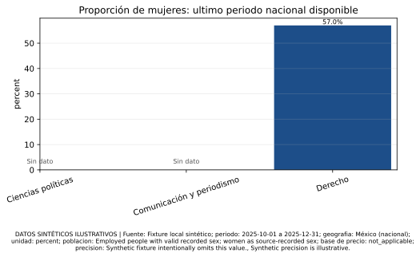
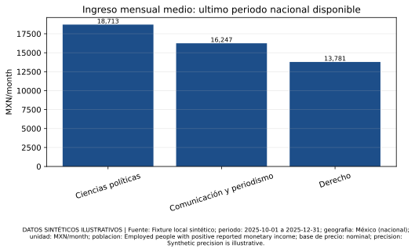
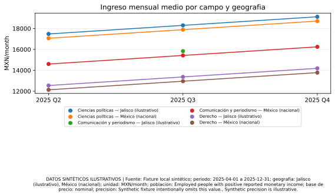

# Brújula Laboral MX · piloto ilustrativo

> **DATOS SINTÉTICOS ILUSTRATIVOS**. Este reporte no representa estimaciones del mercado laboral real.

## Alcance y frescura

- Estado del bundle: `REVIEW`
- Ejecutado: `2026-09-23T01:11:12.928+00:00`
- Frescura por periodo de negocio: `2025-12-31` (estado: `REVIEW`; edad: `265` días)
- Campo y ocupación son conceptos distintos; los bridges editoriales no crean equivalencia.

## Fuentes y condiciones

| Fuente | Acceso | Licencia | Términos | URL | Población | Notas |
| --- | --- | --- | --- | --- | --- | --- |
| Fixture local sintético | local_only | MIT | No disponible | No disponible | Synthetic illustration | Nunca atribuir sus cifras a una fuente real. |

## Observaciones disponibles y brechas

| Concepto | Tipo | Geografía | Periodo | Métrica | Valor | Estado | Unidad | Base | Población | Precisión | Advertencia |
| --- | --- | --- | --- | --- | --- | --- | --- | --- | --- | --- | --- |
| Derecho | field_of_study | México \(nacional\) | 2025 Q2 | Ingreso mensual medio | 12,137 | REVIEW | MXN/month | nominal | Employed people with positive reported monetary income | Synthetic precision is illustrative. | DATOS SINTÉTICOS ILUSTRATIVOS |
| Derecho | field_of_study | México \(nacional\) | 2025 Q2 | Personas ocupadas | 2,726 | REVIEW | people | not_applicable | Employed people | Synthetic precision is illustrative. | DATOS SINTÉTICOS ILUSTRATIVOS |
| Derecho | field_of_study | México \(nacional\) | 2025 Q2 | Proporción de mujeres | 45.0% | REVIEW | percent | not_applicable | Employed people with valid recorded sex; women as source-recorded sex | Synthetic precision is illustrative. | DATOS SINTÉTICOS ILUSTRATIVOS |
| Derecho | field_of_study | Jalisco \(ilustrativo\) | 2025 Q2 | Ingreso mensual medio | 12,548 | REVIEW | MXN/month | nominal | Employed people with positive reported monetary income | Synthetic precision is illustrative. | DATOS SINTÉTICOS ILUSTRATIVOS |
| Derecho | field_of_study | Jalisco \(ilustrativo\) | 2025 Q2 | Personas ocupadas | 3,065 | REVIEW | people | not_applicable | Employed people | Synthetic precision is illustrative. | DATOS SINTÉTICOS ILUSTRATIVOS |
| Derecho | field_of_study | Jalisco \(ilustrativo\) | 2025 Q2 | Proporción de mujeres | 48.0% | REVIEW | percent | not_applicable | Employed people with valid recorded sex; women as source-recorded sex | Synthetic precision is illustrative. | DATOS SINTÉTICOS ILUSTRATIVOS |
| Derecho | field_of_study | México \(nacional\) | 2025 Q3 | Ingreso mensual medio | 12,959 | REVIEW | MXN/month | nominal | Employed people with positive reported monetary income | Synthetic precision is illustrative. | DATOS SINTÉTICOS ILUSTRATIVOS |
| Derecho | field_of_study | México \(nacional\) | 2025 Q3 | Personas ocupadas | 3,404 | REVIEW | people | not_applicable | Employed people | Synthetic precision is illustrative. | DATOS SINTÉTICOS ILUSTRATIVOS |
| Derecho | field_of_study | México \(nacional\) | 2025 Q3 | Proporción de mujeres | 51.0% | REVIEW | percent | not_applicable | Employed people with valid recorded sex; women as source-recorded sex | Synthetic precision is illustrative. | DATOS SINTÉTICOS ILUSTRATIVOS |
| Derecho | field_of_study | Jalisco \(ilustrativo\) | 2025 Q3 | Ingreso mensual medio | 13,370 | REVIEW | MXN/month | nominal | Employed people with positive reported monetary income | Synthetic precision is illustrative. | DATOS SINTÉTICOS ILUSTRATIVOS |
| Derecho | field_of_study | Jalisco \(ilustrativo\) | 2025 Q3 | Personas ocupadas | No disponible | UNKNOWN | people | not_applicable | Employed people | Synthetic fixture intentionally omits this value. | DATOS SINTÉTICOS ILUSTRATIVOS |
| Derecho | field_of_study | Jalisco \(ilustrativo\) | 2025 Q3 | Proporción de mujeres | 54.0% | REVIEW | percent | not_applicable | Employed people with valid recorded sex; women as source-recorded sex | Synthetic precision is illustrative. | DATOS SINTÉTICOS ILUSTRATIVOS |
| Derecho | field_of_study | México \(nacional\) | 2025 Q4 | Ingreso mensual medio | 13,781 | REVIEW | MXN/month | nominal | Employed people with positive reported monetary income | Synthetic precision is illustrative. | DATOS SINTÉTICOS ILUSTRATIVOS |
| Derecho | field_of_study | México \(nacional\) | 2025 Q4 | Personas ocupadas | 4,082 | REVIEW | people | not_applicable | Employed people | Synthetic precision is illustrative. | DATOS SINTÉTICOS ILUSTRATIVOS |
| Derecho | field_of_study | México \(nacional\) | 2025 Q4 | Proporción de mujeres | 57.0% | REVIEW | percent | not_applicable | Employed people with valid recorded sex; women as source-recorded sex | Synthetic precision is illustrative. | DATOS SINTÉTICOS ILUSTRATIVOS |
| Derecho | field_of_study | Jalisco \(ilustrativo\) | 2025 Q4 | Ingreso mensual medio | 14,192 | REVIEW | MXN/month | nominal | Employed people with positive reported monetary income | Synthetic precision is illustrative. | DATOS SINTÉTICOS ILUSTRATIVOS |
| Derecho | field_of_study | Jalisco \(ilustrativo\) | 2025 Q4 | Personas ocupadas | No disponible | UNKNOWN | people | not_applicable | Employed people | Synthetic fixture intentionally omits this value. | DATOS SINTÉTICOS ILUSTRATIVOS |
| Derecho | field_of_study | Jalisco \(ilustrativo\) | 2025 Q4 | Proporción de mujeres | 60.0% | REVIEW | percent | not_applicable | Employed people with valid recorded sex; women as source-recorded sex | Synthetic precision is illustrative. | DATOS SINTÉTICOS ILUSTRATIVOS |
| Comunicación y periodismo | field_of_study | México \(nacional\) | 2025 Q2 | Ingreso mensual medio | 14,603 | REVIEW | MXN/month | nominal | Employed people with positive reported monetary income | Synthetic precision is illustrative. | DATOS SINTÉTICOS ILUSTRATIVOS |
| Comunicación y periodismo | field_of_study | México \(nacional\) | 2025 Q2 | Personas ocupadas | 4,760 | REVIEW | people | not_applicable | Employed people | Synthetic precision is illustrative. | DATOS SINTÉTICOS ILUSTRATIVOS |
| Comunicación y periodismo | field_of_study | México \(nacional\) | 2025 Q2 | Proporción de mujeres | 63.0% | REVIEW | percent | not_applicable | Employed people with valid recorded sex; women as source-recorded sex | Synthetic precision is illustrative. | DATOS SINTÉTICOS ILUSTRATIVOS |
| Comunicación y periodismo | field_of_study | Jalisco \(ilustrativo\) | 2025 Q2 | Ingreso mensual medio | No disponible | UNKNOWN | MXN/month | nominal | Employed people with positive reported monetary income | Synthetic fixture intentionally omits this value. | DATOS SINTÉTICOS ILUSTRATIVOS |
| Comunicación y periodismo | field_of_study | Jalisco \(ilustrativo\) | 2025 Q2 | Personas ocupadas | 5,099 | REVIEW | people | not_applicable | Employed people | Synthetic precision is illustrative. | DATOS SINTÉTICOS ILUSTRATIVOS |
| Comunicación y periodismo | field_of_study | Jalisco \(ilustrativo\) | 2025 Q2 | Proporción de mujeres | 66.0% | REVIEW | percent | not_applicable | Employed people with valid recorded sex; women as source-recorded sex | Synthetic precision is illustrative. | DATOS SINTÉTICOS ILUSTRATIVOS |
| Comunicación y periodismo | field_of_study | México \(nacional\) | 2025 Q3 | Ingreso mensual medio | 15,425 | REVIEW | MXN/month | nominal | Employed people with positive reported monetary income | Synthetic precision is illustrative. | DATOS SINTÉTICOS ILUSTRATIVOS |
| Comunicación y periodismo | field_of_study | México \(nacional\) | 2025 Q3 | Personas ocupadas | 5,438 | REVIEW | people | not_applicable | Employed people | Synthetic precision is illustrative. | DATOS SINTÉTICOS ILUSTRATIVOS |
| Comunicación y periodismo | field_of_study | México \(nacional\) | 2025 Q3 | Proporción de mujeres | 69.0% | REVIEW | percent | not_applicable | Employed people with valid recorded sex; women as source-recorded sex | Synthetic precision is illustrative. | DATOS SINTÉTICOS ILUSTRATIVOS |
| Comunicación y periodismo | field_of_study | Jalisco \(ilustrativo\) | 2025 Q3 | Ingreso mensual medio | 15,836 | REVIEW | MXN/month | nominal | Employed people with positive reported monetary income | Synthetic precision is illustrative. | DATOS SINTÉTICOS ILUSTRATIVOS |
| Comunicación y periodismo | field_of_study | Jalisco \(ilustrativo\) | 2025 Q3 | Personas ocupadas | 5,777 | REVIEW | people | not_applicable | Employed people | Synthetic precision is illustrative. | DATOS SINTÉTICOS ILUSTRATIVOS |
| Comunicación y periodismo | field_of_study | Jalisco \(ilustrativo\) | 2025 Q3 | Proporción de mujeres | 72.0% | REVIEW | percent | not_applicable | Employed people with valid recorded sex; women as source-recorded sex | Synthetic precision is illustrative. | DATOS SINTÉTICOS ILUSTRATIVOS |
| Comunicación y periodismo | field_of_study | México \(nacional\) | 2025 Q4 | Ingreso mensual medio | 16,247 | REVIEW | MXN/month | nominal | Employed people with positive reported monetary income | Synthetic precision is illustrative. | DATOS SINTÉTICOS ILUSTRATIVOS |
| Comunicación y periodismo | field_of_study | México \(nacional\) | 2025 Q4 | Personas ocupadas | 6,116 | REVIEW | people | not_applicable | Employed people | Synthetic precision is illustrative. | DATOS SINTÉTICOS ILUSTRATIVOS |
| Comunicación y periodismo | field_of_study | México \(nacional\) | 2025 Q4 | Proporción de mujeres | No disponible | UNKNOWN | percent | not_applicable | Employed people with valid recorded sex; women as source-recorded sex | Synthetic fixture intentionally omits this value. | DATOS SINTÉTICOS ILUSTRATIVOS |
| Comunicación y periodismo | field_of_study | Jalisco \(ilustrativo\) | 2025 Q4 | Ingreso mensual medio | No disponible | UNKNOWN | MXN/month | nominal | Employed people with positive reported monetary income | Synthetic fixture intentionally omits this value. | DATOS SINTÉTICOS ILUSTRATIVOS |
| Comunicación y periodismo | field_of_study | Jalisco \(ilustrativo\) | 2025 Q4 | Personas ocupadas | 6,455 | REVIEW | people | not_applicable | Employed people | Synthetic precision is illustrative. | DATOS SINTÉTICOS ILUSTRATIVOS |
| Comunicación y periodismo | field_of_study | Jalisco \(ilustrativo\) | 2025 Q4 | Proporción de mujeres | 43.0% | REVIEW | percent | not_applicable | Employed people with valid recorded sex; women as source-recorded sex | Synthetic precision is illustrative. | DATOS SINTÉTICOS ILUSTRATIVOS |
| Ciencias políticas | field_of_study | México \(nacional\) | 2025 Q2 | Ingreso mensual medio | 17,069 | REVIEW | MXN/month | nominal | Employed people with positive reported monetary income | Synthetic precision is illustrative. | DATOS SINTÉTICOS ILUSTRATIVOS |
| Ciencias políticas | field_of_study | México \(nacional\) | 2025 Q2 | Personas ocupadas | 6,794 | REVIEW | people | not_applicable | Employed people | Synthetic precision is illustrative. | DATOS SINTÉTICOS ILUSTRATIVOS |
| Ciencias políticas | field_of_study | México \(nacional\) | 2025 Q2 | Proporción de mujeres | 46.0% | REVIEW | percent | not_applicable | Employed people with valid recorded sex; women as source-recorded sex | Synthetic precision is illustrative. | DATOS SINTÉTICOS ILUSTRATIVOS |
| Ciencias políticas | field_of_study | Jalisco \(ilustrativo\) | 2025 Q2 | Ingreso mensual medio | 17,480 | REVIEW | MXN/month | nominal | Employed people with positive reported monetary income | Synthetic precision is illustrative. | DATOS SINTÉTICOS ILUSTRATIVOS |
| Ciencias políticas | field_of_study | Jalisco \(ilustrativo\) | 2025 Q2 | Personas ocupadas | 7,133 | REVIEW | people | not_applicable | Employed people | Synthetic precision is illustrative. | DATOS SINTÉTICOS ILUSTRATIVOS |
| Ciencias políticas | field_of_study | Jalisco \(ilustrativo\) | 2025 Q2 | Proporción de mujeres | 49.0% | REVIEW | percent | not_applicable | Employed people with valid recorded sex; women as source-recorded sex | Synthetic precision is illustrative. | DATOS SINTÉTICOS ILUSTRATIVOS |
| Ciencias políticas | field_of_study | México \(nacional\) | 2025 Q3 | Ingreso mensual medio | 17,891 | REVIEW | MXN/month | nominal | Employed people with positive reported monetary income | Synthetic precision is illustrative. | DATOS SINTÉTICOS ILUSTRATIVOS |
| Ciencias políticas | field_of_study | México \(nacional\) | 2025 Q3 | Personas ocupadas | No disponible | UNKNOWN | people | not_applicable | Employed people | Synthetic fixture intentionally omits this value. | DATOS SINTÉTICOS ILUSTRATIVOS |
| Ciencias políticas | field_of_study | México \(nacional\) | 2025 Q3 | Proporción de mujeres | 52.0% | REVIEW | percent | not_applicable | Employed people with valid recorded sex; women as source-recorded sex | Synthetic precision is illustrative. | DATOS SINTÉTICOS ILUSTRATIVOS |
| Ciencias políticas | field_of_study | Jalisco \(ilustrativo\) | 2025 Q3 | Ingreso mensual medio | 18,302 | REVIEW | MXN/month | nominal | Employed people with positive reported monetary income | Synthetic precision is illustrative. | DATOS SINTÉTICOS ILUSTRATIVOS |
| Ciencias políticas | field_of_study | Jalisco \(ilustrativo\) | 2025 Q3 | Personas ocupadas | 7,811 | REVIEW | people | not_applicable | Employed people | Synthetic precision is illustrative. | DATOS SINTÉTICOS ILUSTRATIVOS |
| Ciencias políticas | field_of_study | Jalisco \(ilustrativo\) | 2025 Q3 | Proporción de mujeres | 55.0% | REVIEW | percent | not_applicable | Employed people with valid recorded sex; women as source-recorded sex | Synthetic precision is illustrative. | DATOS SINTÉTICOS ILUSTRATIVOS |
| Ciencias políticas | field_of_study | México \(nacional\) | 2025 Q4 | Ingreso mensual medio | 18,713 | REVIEW | MXN/month | nominal | Employed people with positive reported monetary income | Synthetic precision is illustrative. | DATOS SINTÉTICOS ILUSTRATIVOS |
| Ciencias políticas | field_of_study | México \(nacional\) | 2025 Q4 | Personas ocupadas | 8,150 | REVIEW | people | not_applicable | Employed people | Synthetic precision is illustrative. | DATOS SINTÉTICOS ILUSTRATIVOS |
| Ciencias políticas | field_of_study | México \(nacional\) | 2025 Q4 | Proporción de mujeres | No disponible | UNKNOWN | percent | not_applicable | Employed people with valid recorded sex; women as source-recorded sex | Synthetic fixture intentionally omits this value. | DATOS SINTÉTICOS ILUSTRATIVOS |
| Ciencias políticas | field_of_study | Jalisco \(ilustrativo\) | 2025 Q4 | Ingreso mensual medio | 19,124 | REVIEW | MXN/month | nominal | Employed people with positive reported monetary income | Synthetic precision is illustrative. | DATOS SINTÉTICOS ILUSTRATIVOS |
| Ciencias políticas | field_of_study | Jalisco \(ilustrativo\) | 2025 Q4 | Personas ocupadas | 8,489 | REVIEW | people | not_applicable | Employed people | Synthetic precision is illustrative. | DATOS SINTÉTICOS ILUSTRATIVOS |
| Ciencias políticas | field_of_study | Jalisco \(ilustrativo\) | 2025 Q4 | Proporción de mujeres | 61.0% | REVIEW | percent | not_applicable | Employed people with valid recorded sex; women as source-recorded sex | Synthetic precision is illustrative. | DATOS SINTÉTICOS ILUSTRATIVOS |

## Personas ocupadas: ultimo periodo nacional disponible

> **DATOS SINTÉTICOS ILUSTRATIVOS**. La tabla conserva fuente, periodo, geografía, unidad, población, base y precisión.

| Campo de estudio | Valor | Periodo | Geografia | Unidad | Fuente | Poblacion | Base de precio | Precision | Advertencia |
| --- | --- | --- | --- | --- | --- | --- | --- | --- | --- |
| Ciencias políticas | 8,150 | 2025 Q4 | México \(nacional\) | people | Fixture local sintético | Employed people | not_applicable | Synthetic precision is illustrative. | DATOS SINTÉTICOS ILUSTRATIVOS |
| Comunicación y periodismo | 6,116 | 2025 Q4 | México \(nacional\) | people | Fixture local sintético | Employed people | not_applicable | Synthetic precision is illustrative. | DATOS SINTÉTICOS ILUSTRATIVOS |
| Derecho | 4,082 | 2025 Q4 | México \(nacional\) | people | Fixture local sintético | Employed people | not_applicable | Synthetic precision is illustrative. | DATOS SINTÉTICOS ILUSTRATIVOS |

## Proporción de mujeres: ultimo periodo nacional disponible

> **DATOS SINTÉTICOS ILUSTRATIVOS**. La tabla conserva fuente, periodo, geografía, unidad, población, base y precisión.

| Campo de estudio | Valor | Periodo | Geografia | Unidad | Fuente | Poblacion | Base de precio | Precision | Advertencia |
| --- | --- | --- | --- | --- | --- | --- | --- | --- | --- |
| Ciencias políticas | No disponible | 2025 Q4 | México \(nacional\) | percent | Fixture local sintético | Employed people with valid recorded sex; women as source-recorded sex | not_applicable | Synthetic fixture intentionally omits this value. | DATOS SINTÉTICOS ILUSTRATIVOS |
| Comunicación y periodismo | No disponible | 2025 Q4 | México \(nacional\) | percent | Fixture local sintético | Employed people with valid recorded sex; women as source-recorded sex | not_applicable | Synthetic fixture intentionally omits this value. | DATOS SINTÉTICOS ILUSTRATIVOS |
| Derecho | 57.0% | 2025 Q4 | México \(nacional\) | percent | Fixture local sintético | Employed people with valid recorded sex; women as source-recorded sex | not_applicable | Synthetic precision is illustrative. | DATOS SINTÉTICOS ILUSTRATIVOS |

## Ingreso mensual medio: ultimo periodo nacional disponible

> **DATOS SINTÉTICOS ILUSTRATIVOS**. La tabla conserva fuente, periodo, geografía, unidad, población, base y precisión.

| Campo de estudio | Valor | Periodo | Geografia | Unidad | Fuente | Poblacion | Base de precio | Precision | Advertencia |
| --- | --- | --- | --- | --- | --- | --- | --- | --- | --- |
| Ciencias políticas | 18,713 | 2025 Q4 | México \(nacional\) | MXN/month | Fixture local sintético | Employed people with positive reported monetary income | nominal | Synthetic precision is illustrative. | DATOS SINTÉTICOS ILUSTRATIVOS |
| Comunicación y periodismo | 16,247 | 2025 Q4 | México \(nacional\) | MXN/month | Fixture local sintético | Employed people with positive reported monetary income | nominal | Synthetic precision is illustrative. | DATOS SINTÉTICOS ILUSTRATIVOS |
| Derecho | 13,781 | 2025 Q4 | México \(nacional\) | MXN/month | Fixture local sintético | Employed people with positive reported monetary income | nominal | Synthetic precision is illustrative. | DATOS SINTÉTICOS ILUSTRATIVOS |

## Ingreso mensual medio por campo y geografia

> **DATOS SINTÉTICOS ILUSTRATIVOS**. La tabla conserva fuente, periodo, geografía, unidad, población, base y precisión.

| Campo de estudio | Geografia | Periodo | Valor | Disponibilidad | Tratamiento de linea | Poblacion | Base de precio | Precision | Advertencia |
| --- | --- | --- | --- | --- | --- | --- | --- | --- | --- |
| Ciencias políticas | Jalisco \(ilustrativo\) | 2025 Q2 | 17,480 | Disponible | Punto aislado; no hay par comparable declarado | Employed people with positive reported monetary income | nominal | Synthetic precision is illustrative. | DATOS SINTÉTICOS ILUSTRATIVOS |
| Ciencias políticas | Jalisco \(ilustrativo\) | 2025 Q3 | 18,302 | Disponible | Conectado con comparacion declarada | Employed people with positive reported monetary income | nominal | Synthetic precision is illustrative. | DATOS SINTÉTICOS ILUSTRATIVOS |
| Ciencias políticas | Jalisco \(ilustrativo\) | 2025 Q4 | 19,124 | Disponible | Conectado con comparacion declarada | Employed people with positive reported monetary income | nominal | Synthetic precision is illustrative. | DATOS SINTÉTICOS ILUSTRATIVOS |
| Ciencias políticas | México \(nacional\) | 2025 Q2 | 17,069 | Disponible | Punto aislado; no hay par comparable declarado | Employed people with positive reported monetary income | nominal | Synthetic precision is illustrative. | DATOS SINTÉTICOS ILUSTRATIVOS |
| Ciencias políticas | México \(nacional\) | 2025 Q3 | 17,891 | Disponible | Conectado con comparacion declarada | Employed people with positive reported monetary income | nominal | Synthetic precision is illustrative. | DATOS SINTÉTICOS ILUSTRATIVOS |
| Ciencias políticas | México \(nacional\) | 2025 Q4 | 18,713 | Disponible | Conectado con comparacion declarada | Employed people with positive reported monetary income | nominal | Synthetic precision is illustrative. | DATOS SINTÉTICOS ILUSTRATIVOS |
| Comunicación y periodismo | Jalisco \(ilustrativo\) | 2025 Q2 | No disponible | No disponible | Brecha por valor o estado no disponible | Employed people with positive reported monetary income | nominal | Synthetic fixture intentionally omits this value. | DATOS SINTÉTICOS ILUSTRATIVOS |
| Comunicación y periodismo | Jalisco \(ilustrativo\) | 2025 Q3 | 15,836 | Disponible | Punto aislado; no hay par comparable declarado | Employed people with positive reported monetary income | nominal | Synthetic precision is illustrative. | DATOS SINTÉTICOS ILUSTRATIVOS |
| Comunicación y periodismo | Jalisco \(ilustrativo\) | 2025 Q4 | No disponible | No disponible | Brecha por valor o estado no disponible | Employed people with positive reported monetary income | nominal | Synthetic fixture intentionally omits this value. | DATOS SINTÉTICOS ILUSTRATIVOS |
| Comunicación y periodismo | México \(nacional\) | 2025 Q2 | 14,603 | Disponible | Punto aislado; no hay par comparable declarado | Employed people with positive reported monetary income | nominal | Synthetic precision is illustrative. | DATOS SINTÉTICOS ILUSTRATIVOS |
| Comunicación y periodismo | México \(nacional\) | 2025 Q3 | 15,425 | Disponible | Conectado con comparacion declarada | Employed people with positive reported monetary income | nominal | Synthetic precision is illustrative. | DATOS SINTÉTICOS ILUSTRATIVOS |
| Comunicación y periodismo | México \(nacional\) | 2025 Q4 | 16,247 | Disponible | Conectado con comparacion declarada | Employed people with positive reported monetary income | nominal | Synthetic precision is illustrative. | DATOS SINTÉTICOS ILUSTRATIVOS |
| Derecho | Jalisco \(ilustrativo\) | 2025 Q2 | 12,548 | Disponible | Punto aislado; no hay par comparable declarado | Employed people with positive reported monetary income | nominal | Synthetic precision is illustrative. | DATOS SINTÉTICOS ILUSTRATIVOS |
| Derecho | Jalisco \(ilustrativo\) | 2025 Q3 | 13,370 | Disponible | Conectado con comparacion declarada | Employed people with positive reported monetary income | nominal | Synthetic precision is illustrative. | DATOS SINTÉTICOS ILUSTRATIVOS |
| Derecho | Jalisco \(ilustrativo\) | 2025 Q4 | 14,192 | Disponible | Conectado con comparacion declarada | Employed people with positive reported monetary income | nominal | Synthetic precision is illustrative. | DATOS SINTÉTICOS ILUSTRATIVOS |
| Derecho | México \(nacional\) | 2025 Q2 | 12,137 | Disponible | Punto aislado; no hay par comparable declarado | Employed people with positive reported monetary income | nominal | Synthetic precision is illustrative. | DATOS SINTÉTICOS ILUSTRATIVOS |
| Derecho | México \(nacional\) | 2025 Q3 | 12,959 | Disponible | Conectado con comparacion declarada | Employed people with positive reported monetary income | nominal | Synthetic precision is illustrative. | DATOS SINTÉTICOS ILUSTRATIVOS |
| Derecho | México \(nacional\) | 2025 Q4 | 13,781 | Disponible | Conectado con comparacion declarada | Employed people with positive reported monetary income | nominal | Synthetic precision is illustrative. | DATOS SINTÉTICOS ILUSTRATIVOS |

## Paquetes de insight

### Señal ilustrativa: Ciencias políticas

- Observación: El fixture sintético registra Ingreso mensual medio de 18,713 MXN/month para Ciencias políticas en México \(nacional\), 2025 Q4, con población Employed people with positive reported monetary income y método illustrative_formula_v1, según la fuente demo_fixture_source.
- Interpretación: Describe únicamente el fixture, la población y el periodo indicados.
- Recomendación: Revise fuente, población, unidad, método y precisión antes de usar la señal.
- Incertidumbres: El fixture no es una estimación oficial.; La precisión muestral no está cuantificada.
- Evidencia: demo_evidence_fixture

### Señal ilustrativa: Comunicación y periodismo

- Observación: El fixture sintético registra Ingreso mensual medio de 16,247 MXN/month para Comunicación y periodismo en México \(nacional\), 2025 Q4, con población Employed people with positive reported monetary income y método illustrative_formula_v1, según la fuente demo_fixture_source.
- Interpretación: Describe únicamente el fixture, la población y el periodo indicados.
- Recomendación: Revise fuente, población, unidad, método y precisión antes de usar la señal.
- Incertidumbres: El fixture no es una estimación oficial.; La precisión muestral no está cuantificada.
- Evidencia: demo_evidence_fixture

### Señal ilustrativa: Derecho

- Observación: El fixture sintético registra Ingreso mensual medio de 13,781 MXN/month para Derecho en México \(nacional\), 2025 Q4, con población Employed people with positive reported monetary income y método illustrative_formula_v1, según la fuente demo_fixture_source.
- Interpretación: Describe únicamente el fixture, la población y el periodo indicados.
- Recomendación: Revise fuente, población, unidad, método y precisión antes de usar la señal.
- Incertidumbres: El fixture no es una estimación oficial.; La precisión muestral no está cuantificada.
- Evidencia: demo_evidence_fixture

